# Use case: Retail shelf analysis

## Table of contents
- [Use case: Retail shelf analysis](#use-case-retail-shelf-analysis)
  - [Table of contents](#table-of-contents)
  - [Introduction](#introduction)
    - [Pre-requisites](#pre-requisites)
  - [watsonx Orchestrate ADK](#watsonx-orchestrate-adk)
  - [The tools](#the-tools)
    - [Image to text tool](#image-to-text-tool)
      - [Connections](#connections)
      - [Langchain](#langchain)
      - [The @tool annotation](#the-tool-annotation)
      - [Local test](#local-test)
      - [Importing the tool](#importing-the-tool)
    - [Web search tool](#web-search-tool)
  - [The agents](#the-agents)
    - [Starting the Chat UI](#starting-the-chat-ui)
    - [The Internet Research Agent](#the-internet-research-agent)
    - [The Market Analyst Agent](#the-market-analyst-agent)
    - [The Retail Market Agent](#the-retail-market-agent)
  - [Final test and Summary](#final-test-and-summary)
  - [(Optional) Uploading the solution to a watsonx Orchestrate SaaS instance](#optional-uploading-the-solution-to-a-watsonx-orchestrate-saas-instance)
    - [Remote environment configuration](#remote-environment-configuration)
    - [Importing connections, tools and agents](#importing-connections-tools-and-agents)
  - [(Optional) Headless Agent](#optional-headless-agent)
    - [Code Walkthrough](#code-walkthrough)
      - [The local HTTP server](#the-local-http-server)
      - [Running the app](#running-the-app)

## Introduction
This use case describes a scenario where a user can submit an image, i.e. a photograph that contains a shelf of products. Products are expected to be consumer products, that is, shoes, clothing, food, household supplies etc. The system will analyze the content of the image, i.e. identify the products shown, retrieve market trends for those products via web search, and finally develop recommendations and an action plan for how to reorganize the shelf to align with those market trends. A user is also able to ask questions about active recall notices for products in an image or by product name and get the latest information about them from the internet and if required create a work order for removal of product from selves.

The solution consists of several agents who are working together to address the problem at hand:
- The `Internet Research Agent` 
- The `Market Analyst Agent` 
- The `Retail Market Agent` 
- The `Ticket Manager Agent`

Details about each agent and their purpose will be covered below. We will use the [IBM watsonx Orchestrate Agent Developer Kit (ADK)](https://developer.watson-orchestrate.ibm.com/) to create the solution.

### Pre-requisites
  
**Participants**:
- Validate that you have access to the right environment for this lab.
- Complete the [environment-setup](retail_env_setup.md) guide to set up the ADK environment.
- Validate that you have access to a credentials file that your instructor will share with you before starting the labs.
- Familiarity with AI agent concepts (e.g., instructions, tools, collaborators...)
- Setup IBM Bob IDE on your local.

## watsonx Orchestrate ADK
As mentioned above, we will use the ADK to develop and test the solution. The ADK consists of the following elements:
- a set of containers that run the core elements of the watsonx Orchestrate server, all orchestrated as a single set via docker-compose. 
- a container hosting the UI element, which lets you create and manage agents, as well as testing them via chat interface.
- a CLI that allows simple interactions with watsonx Orchestrate (both the locally running server as well as any SaaS instance), including importing of agents and tools, starting and stopping the server, and more.
  
We will assume here that as part of the setup, you have gained access to an environment (which could be your own laptop) that lets you access the server via browser window, as well as giving you a command line terminal in which you can enter CLI commands. Moreover, we will do the code development in an instance of IBM Bob. 

You can decide to which level of detail you want to explore this use case. You can take the code and the related configuraton as is and simply deploy and run them. Or, you can change some of the details and see what the impact of your change is. For example, change the prompts you are using, or switch the model to a different one. And you can tinker with the code, too! Think of the ADK environment as a developer environment in which you can develop and test before uploading the solution to a shared SaaS environment. 

> Note that the screenshots below may vary slightly, depending on which environment you are using, but the exact same functionality is offered regardless of which environment you choose. Also, if you decide to change models, you can try: `meta-llama/llama-4-maverick-17b-128e-instruct-fp8`

## The tools
As part of the solution, we will create two tools:
1. a tool that utilizes a watsonx.ai vision model to create a description of the picture that was submitted by the user, and
2. a tool that can search the web powered by Tavily. This tool will be used to find the market trends.
3. an mcp tool that can search the web powered by DuckDuckGo. This tool will be used to find the recall notices.

### Image to text tool
This tool takes the URL of an image hosted on the Internet as input, and returns the description of that image. 

> Why a URL? Initially this was a work around, but now you would just have to declare the input type `Bytes` and you would get a widget to upload and download files as needed. 

The code for this tool is in [this Python file](./src/tools/generate_description_from_image.py). Feel free to open this file in your IBM Bob environment to follow along our explanation of the code. Rather than going through it line by line, we will point out those sections of the code that we want to take a closer look at.

The code starts with a set of import statements. To run the code, either within watsonx Orchestrate or on the command line, you need to make sure a set of packages are installed. The [requirements.txt](./src/tools/requirements.txt) file lists all of the required packages. To run it locally, you need to run `pip install -r requirements.txt` with this file. When using this code inside a tool, we can impport this file together with the code, and the server will install the listed packages into the runtime the first time the tool is called. 

Next you will find this line:
```
CONNECTION_WATSONX_AI = 'watsonxai'
```

#### Connections
watsonx Orchestrate uses a concept called "connections" to allow passing in certain runtime values, for example, API keys, separately from the code, so that they don't have to be hardcoded in the code. A `Connection` is a separately created and maintained entity that binds values to their respective keys, and the tool can resolve those values at runtime. 
Since this tool uses watsonx.ai to retrieve the image description, we need to fill some variables with required values:
- The model ID of the model we will use. It has to be a model capable of interpreting images, for example, `meta-llama/llama-3-2-90b-vision-instruct`.
- The API key of the IBM cloud account your watsonx.ai instance is running in.
- The project ID of a watsonx.ai project that is associated with a runtime. 

Further down in the code, you can see how we are resolving the value for a certain key:
```
model_id = connections.key_value(CONNECTION_WATSONX_AI)['modelid']
```

You can find more information about connections in the [watsonx Orchestrate ADK documentation](https://developer.watson-orchestrate.ibm.com/connections/build_connections).

The code in the tool was written in a way that also allows it to be called from the command line. When running it this way, it doesn't have access to `Connections` objects. You will see in the code, towards the bottom of the file, that in the main function (which is only called when running from the command line), it uses the `load_dotenv()` function to set the required environment variables.

#### Langchain
In the import section of the code, you will see the following line:
```
from langchain_ibm import ChatWatsonx
```
This indicates that we are using the [IBM watsonx extension to Langchain](https://python.langchain.com/api_reference/ibm/index.html), and specifically, its `ChatWatsonx` model. This class allows simple interactions with the watsonx.ai backend. You set it up with a set of parameters (the code below is from the `generate_description_from_image()` function:
```
    watsonx_model = ChatWatsonx(
                        model_id=model_id,
                        url="https://us-south.ml.cloud.ibm.com",
                        apikey=api_key,
                        space_id=space_id,
                        params={
                            GenParams.TEMPERATURE: 0.5,
                            GenParams.MAX_NEW_TOKENS: 1000
                        }
    )
```
The message we will send to that model object is of type `HumanMessage`, which is imported from `langchain_core.messages`. The creation of the message is located in the `contruct_message()` function:
```
    message = HumanMessage(
        content=[
            {"type": "text", "text": prompt_text},
            {"type": "image_url",
             "image_url": {"url": f"data:image/{image_format};base64,{image_data}"}}
        ]
```
Note how the message contains both a text prompt and an image. The image is encoded in base64 format. In the code, the retrieval of the image from the passed in URL, and its encoding into base64, happens in the `encode_image_to_base64()` function:
```
def encode_image_to_base64(image_url: str) -> Optional[str]:
    headers = {"User-Agent": "Mozilla/5.0"}
    response = requests.get(image_url, headers=headers)
    response.raise_for_status()  # Raise an error for bad responses
    image_bytes = response.content
    encoded = base64.b64encode(image_bytes).decode('utf-8')
    return encoded
```        
#### The @tool annotation
The overall flow of the tool is like this:
- invoke generate_description_from_image(), pass in image URL
  - create ChatWatsonX model instance
- use encode_image_to_base64() to retrieve image content
- use construct_message to create HumanMessage instance
- call `model.invoke()` to return description of image content

Note that the main entry point for the tool is the `generate_description_from_image()` function. This is indicated by the `@tool`~ annotation that prefixes the function declaration, paired with an indication of the `Connection` that is being used:
```
@tool(
        {"app_id": CONNECTION_WATSONX_AI, "type": ConnectionType.KEY_VALUE}
)
def generate_description_from_image(image_url: str) -> str:
    """
    Takes an image URL, encodes it to base64, and generates a description using Watsonx.ai.

    Parameters:
    image_url (str): The URL of the image file.

    Returns:
    str: The generated description of the image.
    """
```

Another important element of the code extract above is the description. This description is what the agent uses to determine whether the tool is right for the task at hand. Therefore, it is critically important to include a crisp and detailed description of the functionality of the tool. There is no other place where this is described! 

#### Local test
As mentioned above, you can run this tool from the command line to test the code. Note, however, that it is expecting a file named `.env` to be available in the same folder as where you start the Python interpreter from. You will see later that the watsonx Orchestrate ADK also requires a .env file when being started. You can reuse the same file for both purposes. Note that because of the reuse, the actual file has more entries than shown below.
```
WATSONX_MODEL_ID=meta-llama/llama-3-2-90b-vision-instruct
WATSONX_APIKEY=oj5BW-...... [insert your API key here]
WATSONX_SPACE_ID=186ac9b7-35ec....... [insert your space ID here]
```
You call the tool from the command line like this (make sure you are in the root folder of the content repo):
`python ./src/tools/generate_description_from_image.py --url https://i.imgur.com/qfiugNJ.jpeg`

#### Importing the tool
The easiest way to import the tool into your ADK instance is to use the CLI. Remember that we are using the concept of a `Connection` to insert the right values for API key etc? Before we can import the tool, we need to create the Connection instance (the import will fail otherwise).
We can store the Connection details in a [YAML file named watsonxai.yaml](./src/connections/watsonxai.yaml): 
```
spec_version: v1
kind: connection
app_id: watsonxai
environments:
    draft:
        kind: kv
        type: team
    live:
        kind: kv
        type: team
```
Note that the YAML defines two `environments`, namely `draft` and `live`. This allows setting credentials for different environments to different values. When using the ADK locally, there is only one environment supported, namely `draft`. The other definition will be ignored. However, we will need the `live` environment when uploading the solution to a remote SaaS instance (which is covered [further below](#optional-uploading-the-solution-to-a-watsonx-orchestrate-saas-instance)), so we have included it into the file.

Optional (if you haven't set up your ADK and activated your environment during this [step](./retail_env_setup.md/#watsonx-orchestrate-adk)):
```
source .env
orchestrate env add -n wxo-kroger -u $WXO_URL --type ibm_iam --activate
```

Create the Connection instance with the CLI like this:
```
orchestrate connections import -f ./src/connections/watsonxai.yaml
```

Next, we need to set the actual values for model ID, API key and project ID. Note that these values need to be added in one call, in other words, whenever you call the `set-credentials` subcommand, it will overwrite what had been defined before.
Below is a script that shows how you can use the same .env file we used earlier to set up the Connections object:
```
source .env
orchestrate connections set-credentials -a watsonxai --env "draft" -e "modelid=${WATSONX_MODEL_ID}" -e "spaceid=${WATSONX_SPACE_ID}" -e "apikey=${WATSONX_APIKEY}"
```

After this, you are finally ready to import the tool. On the command line, enter the following command to do so (make sure you are in the right folder when calling it):
```
orchestrate tools import -k python -f ./src/tools/generate_description_from_image.py -r ./src/tools/requirements.txt -a watsonxai
```
You can make sure that the tool was successfully imported by running the following command on the command line:
```
orchestrate tools list
```

We will test this tool via an agent further below, but first let's create and import the second tool of this use case.

### Web search tool

This tool is executing a simple web search, using a service called [Tavily](https://www.tavily.com/). There is good integration with this tool via the Langchain Community Tools library, which we will take advantage of here.

Here you will practice your coding skills! The [provided Python file](./src/tools/web_search.py) is incomplete, and we are asking you to fill in the blanks, so to speak. You can use [the image description tool](#image-to-text-tool) discussed above as a reference example for what the code should look like.

> You can choose to skip this exercise and simply use the completed code in the [web_search.py.complete](./src/tools/web_search.py.complete) file.

The required import statements are already filled into the file. Note how it declares a variable called `CONNECTION_TAVILY`; this represents the name of the connection that is used to retrieve the Tavily API key. You can find sample code showing how to retrieve the value from the connection in the image description tool.

The tool contains one function called web_search. In the @tool declaration, add the definition of the connection so that it is available in the body of the function.
The function itself should leverage the [langchain.community.tools.tavily_search.tool.TavilysearchResults](https://python.langchain.com/api_reference/community/tools/langchain_community.tools.tavily_search.tool.TavilySearchResults.html) class to execute the actual search.

Feel free to add a "\_\_main\_\_" function for testing, again using the image description tool as an example for what that looks like. 

Once you have verified that the code is working as expected, we can import the tool into watsonx Orchestrate. However, before we do so, we need to create yet another `Connection` object, namely one that contains the Tavily API key. The details of that connection are stored in the [tavily.yaml](./src/connections/tavily.yaml) file:
```
spec_version: v1
kind: connection
app_id: tavily
environments:
    draft:
        kind: kv
        type: team
    live:
        kind: kv
        type: team
```

Create the new object by entering the following on the command line:
```
orchestrate connections import -f ./usecases/retail/src/connections/tavily.yaml
```
> You will see a warning about the configuration for the `live` environment, you can safely ignore that warning here, we will use the `live` environment only when connected to a remote SaaS instance.

And as before, we use the `set-credentials` subommand to set the actual value of the Tavily API key that is used by the tool. We can use a slightly modified version of the script we used before:
```
#!/bin/bash

# Use default if no argument was passed
DEFAULT_TARGET_ENV="draft"
TARGET_ENV="${1:-$DEFAULT_TARGET_ENV}"

# Load variables from .env
set -o allexport
source .env
set +o allexport

# set the credentials
orchestrate connections set-credentials -a tavily --env "${TARGET_ENV}" -e "apikey=${TAVILY_API_KEY}"
```

The final step is to import the tool:
```
orchestrate tools import -k python -f ./usecases/retail/src/tools/web_search.py -r ./usecases/retail/src/tools/requirements.txt -a tavily
```

Verify that the second tool was successfully imported by using the `orchestrate tools list` command.
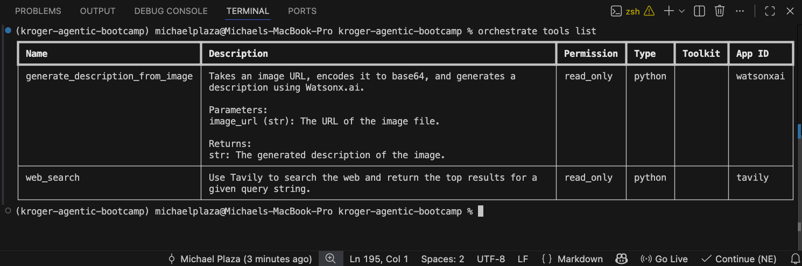


> Note: We will add the MCP tool later via the UI with the Internet Research Agent.

## The agents

We will create three agents to implement this use case:
- The Internet Research Agent handles the interpretation of any images that are submitted by the user, and runs web searches to identify market trends related to the relevant products.
- The Market Analyst Agent will analyze market trends and develop related recommendations and create an action plan.
- The Retail Market Agent is the supervisory agent that interacts with the user and collaborates with other agents, i.e. the two agents listed above, to create the final answer for the user.

Each agent will be defined inside a YAML file that we can easily import into watsonx Orchestrate for testing, but we will also take you through the UI-based Agent Builder tool.

### Starting the Chat UI

Before we can start defining our first agent via the UI, we have to import at least one agent into the environment via YAML. The reason being that without having an agent defined, the UI will not start. We could simply import one of the agents discussed below, but since we want to take you through the UI to define those, we will import a sample agent here to allow the UI to start. 

The sample agent offers insight into IBM, and it uses a "knowledge base" consisting of a number of PDF files as its source. First, we need to import this new knowledge base. Enter the following on the command line:
```
orchestrate knowledge-bases import -f ./usecases/retail/src/ibm_knowledge/knowledge_base/ibm_knowledge_base.yaml
```

After creating the knowledge base, we can import the actual agent:
```
orchestrate agents import -f ./usecases/retail/src/ibm_knowledge/agents/ibm_agent.yaml
```

You can try out this agent later, for now we will leave it alone and continue with our retail use case.

### The Internet Research Agent

This agent will leverage both tools we defined and imported earlier to help answer requests. The main intended use of this agent is to take an image of a product shelf as input, and return both a description of the displayed products as well as related market trends to the user. The first part uses the image to text tool, the second part uses the web search tool.

In this case, we will define this agent interactively in the UI of watsonx Orchestrate. It offers an easy-to-use interface to enter all the relevant fields.
Start out by making sure the local UI server is started, if you haven't already done so:
```
orchestrate chat start --env-file .env
```

This will open the browser window with the watsonx Orchestrate homepage.
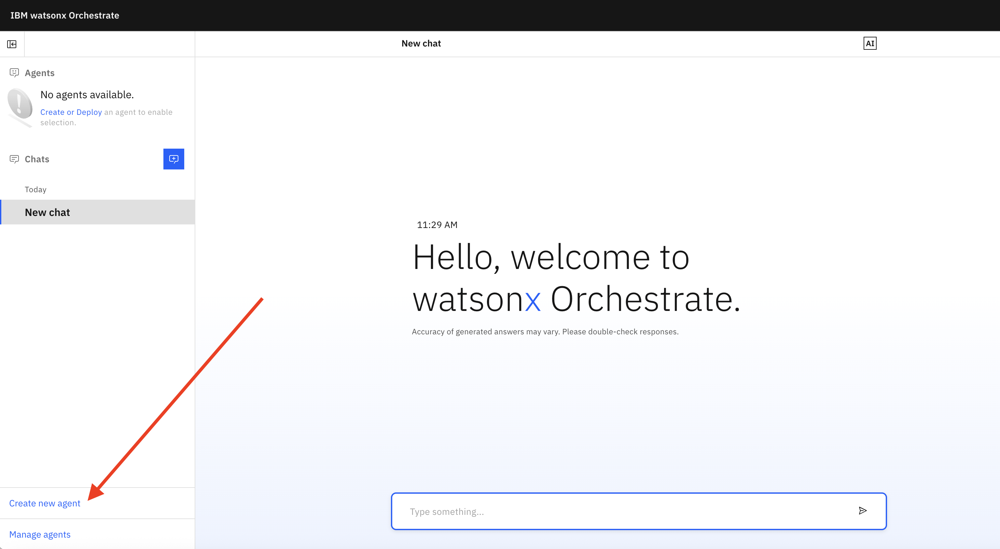

Click on the `Create new agent` link at the bottom right corner of the page.

In the next window, leave the `Create from scratch` option selected. Enter "internet_research_agent" as the name of the new agent, and enter the following description:
```
The Internet Research Agent assists with identifying market trends for all products that can be found on images. If asked for recall information about products, it also assists with identifying active recall notices on products mentioned or found on images.
```


Click on `Create`.

On the next page, scroll down to the `Toolsets` section and click on `Add tool`.

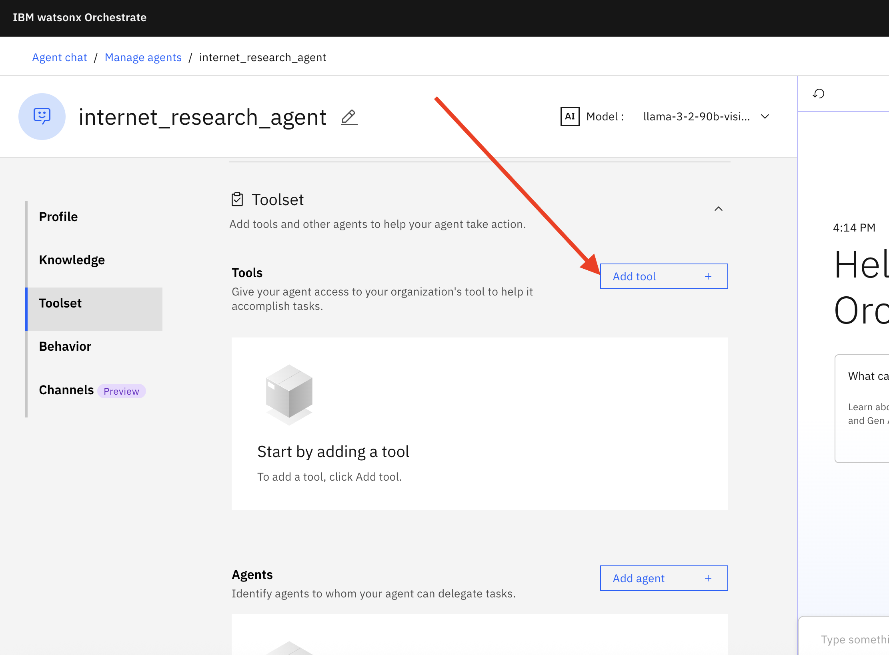

Since we already imported the tools we need, you can click on on `Add from local instance`:

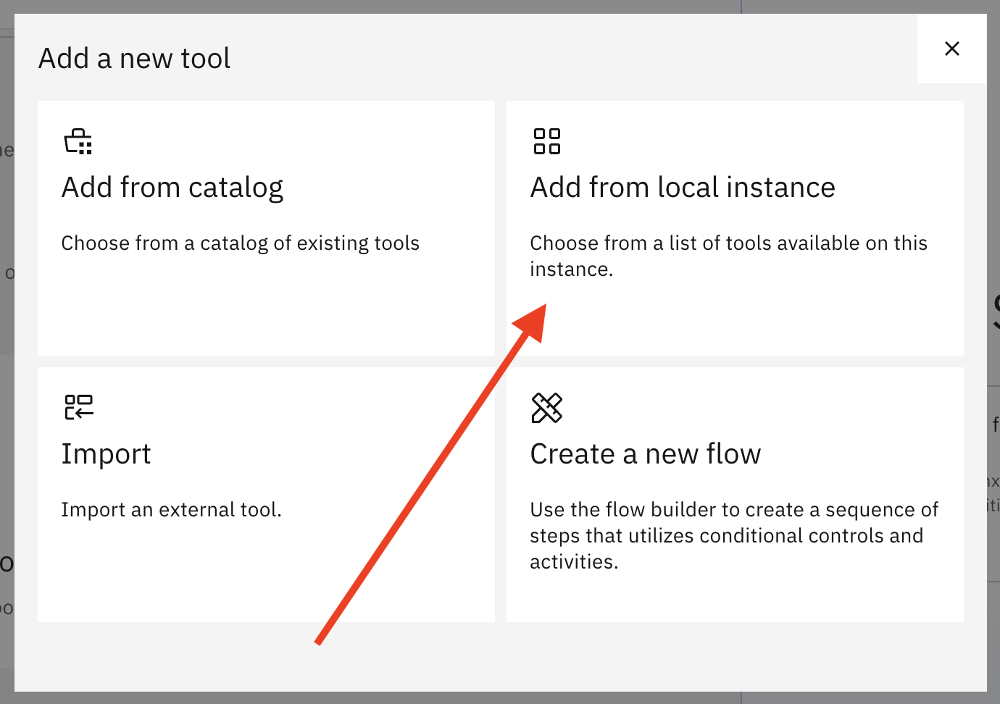

In the following window, select the two tools we created earlier and click on `Add to agent`.
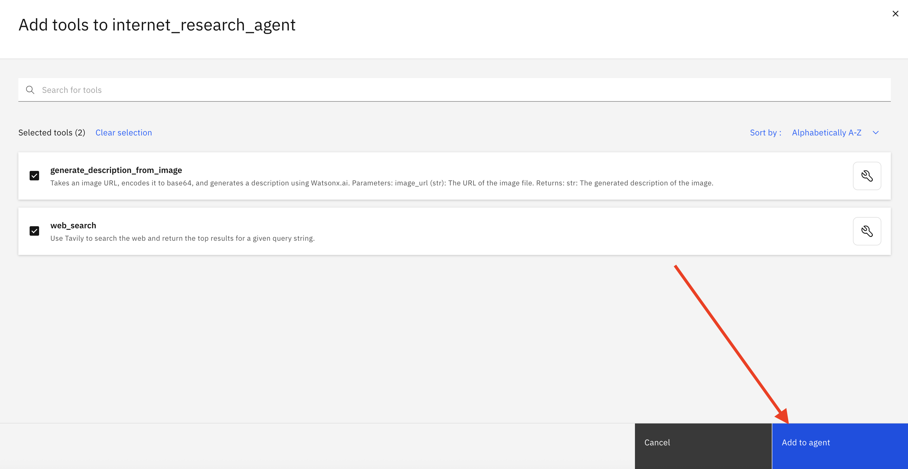

Next is a really important part: we need to explain to the agent when and how to use the tools we added. This is done in the `Behavior` section further down the page. Besides the specifics of the tools, this also includes general instructions about how we want the agent to behave. Think of this as defining the agent's 'system prompt'. 

Enter the following text into the `Instructions` field:
```

Persona:
    - Your purpose is to show market trends or active product recall notices based on products identified from an image of a product shelf or from a provided product name. You must decide which task the user is requesting before calling any tool. You must perform only one task per request either market trends or product recall. Use detailed language to describe the content.

  Context:
    - You are used for market trend research based on image descriptions or for identifying active recall notices of products in an image or by name.
    - Market trends and recall notices are mutually exclusive workflows.
    - Use detailed language to describe the content for both tasks

 Key instructions for how and when the tools should be called:
   - Intent selection (required):
     If the user mentions recall, safety, defect, warning, FDA, or asks if a product is recalled, the intent is to find Product Recall Notices. Otherwise the intent is to find Market Trends.
   - Image analysis (required when an image is provided): Use the generate_description_from_image tool to create a description of a specific image. Pass in the URL of the image the description is requested for. 
   - Product Recall Notices: Only use the websearch_mcp:search_web tool to fetch information about any active recall notices for the product mentioned or list of "Product Names" returned from from the generate_description_from_image tool and also when the recall notices were issued from internet search. Important - Do not call web_search tool
   - Market Trends: Only use the web_search tool to find market trends for the content of the image. Summarize the content that was returned from the generate_description_from_image tool. Important - Do not call websearch_mcp:search_web.

Tool locking rule:
- If Product Recall Notices is selected as intent, web_search is unavailable.
- If Market Trends is selected as intent, websearch_mcp:search_web is unavailable.
- Calling an unavailable tool makes the response invalid.
```

Note how we divided the instructions into separate sections for persona, context and key instructions and tool locking. The the key instructions and tool locking part contains instructions about the tools - how and when to use them.

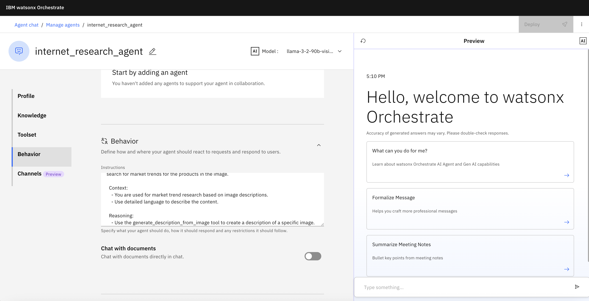

#### Let's Add the MCP Server to the Agent now
- Click on Add tool
  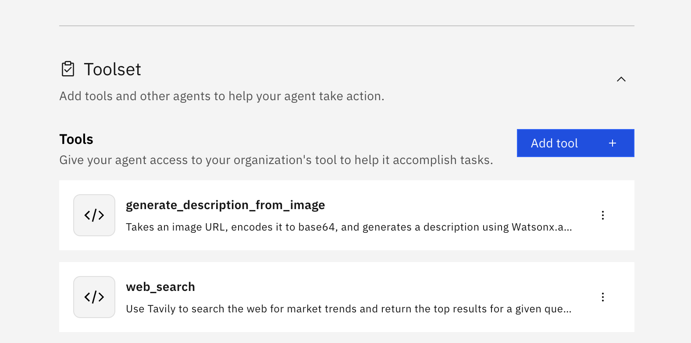
- Click on MCP Server
  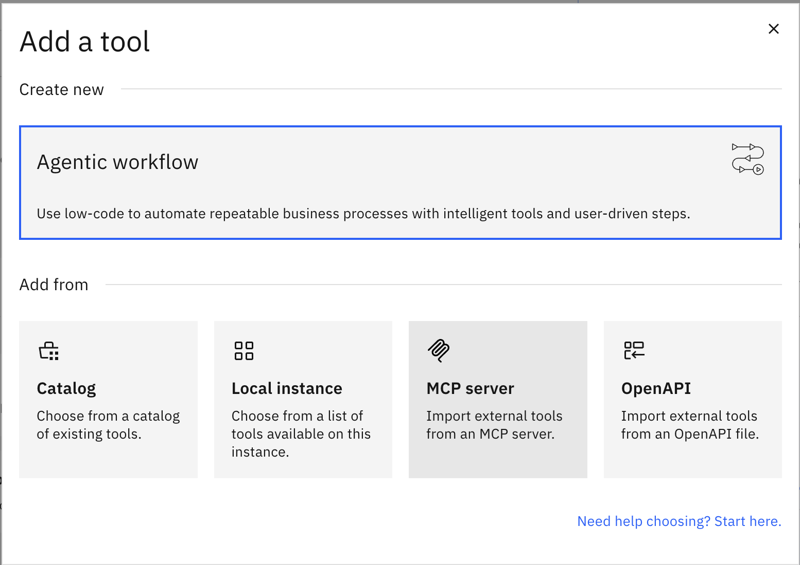
- Click on Add MCP Server
  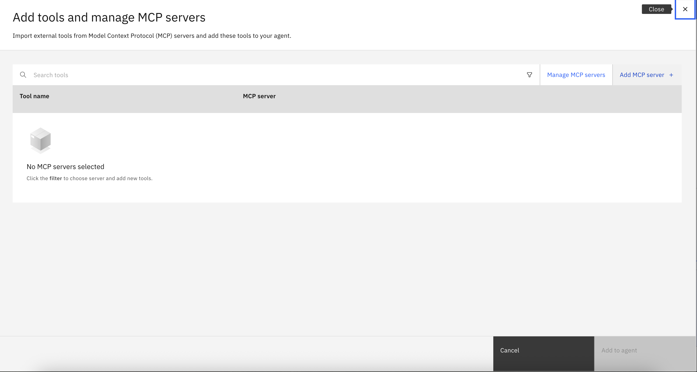
- Select Local MCP Server and click on next
  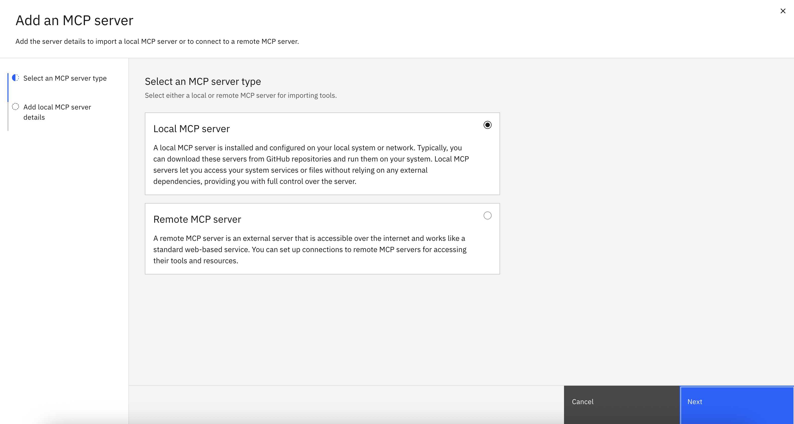
- Enter the following details for the MCP server and click on Import.
> Server name - websearch_mcp
> 
> Description - This mcp server searches the web with duckduckgo, specifically searching the web for recalls of products.
> 
> Install command - npx -y @guhcostan/web-search-mcp
  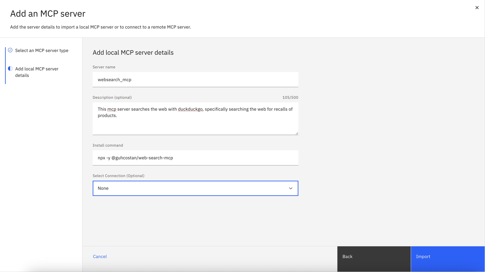
- Once you add the MCP server you should see a tool for `websearch_mcp:fetch_page` select and click on add to Agent. If you do not see it directly, click on `Add Tool` again, click on `Local Instance` and search for `websearch_mcp:fetch_page`. Select it and click on add to agent.
  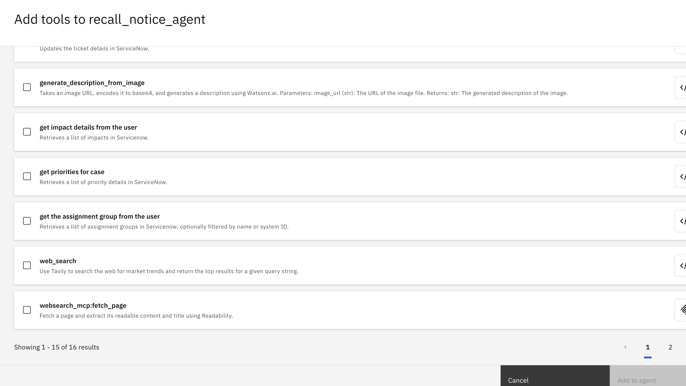
  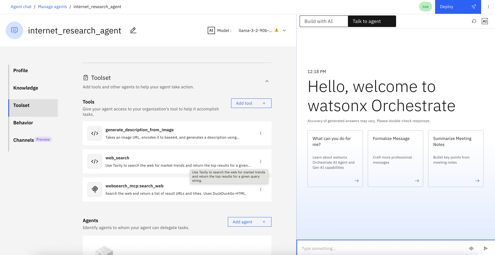
The `Show agent` switch, at the bottom of the agent configuration page, controls whether or not the agent will be visible on the main watsonx Orchestrate page. We will leave this on for now, but eventually we will switch it off, because we want users to only use the supervisory agent (which we will create below).

We can now test our new agent right here in this page, using the `Preview` window. Let's test if both tools are properly invoked if we give the agent the right task. For example, we can give the agent a URL with the image, and then ask it to tell us about related market trends, like this:
```
Please look at the image at https://i.imgur.com/qfiugNJ.jpeg, and give me current market trends based on the products shown in the image.
```
You can also test the agent for recalls with the following:
```
Check if there is a recall notice on Spring & Mulberry chocolates?
```

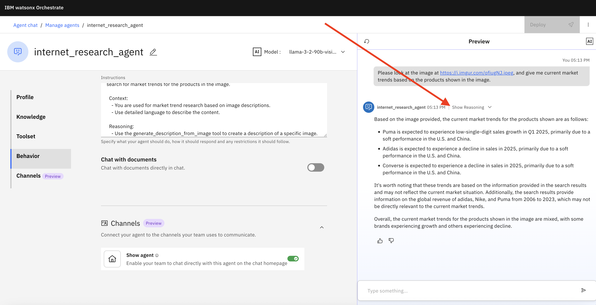

Note how you can expand the `Show reasoning` link in the Preview window to see the individual steps that were taken, including the calls to the two tools.


We can now export the metadata for this agent into a YAML file. This allows us to easily import the same agent in any watsonx Orchestrate environment, including a SaaS instance in IBM Cloud. However, you need to enter the name of the agent, which is not what you entered into the `Name` field when creating the agent. The tool will automatically append a unique identifier to the end. To get the name, you can run `orchestrate agents list`.

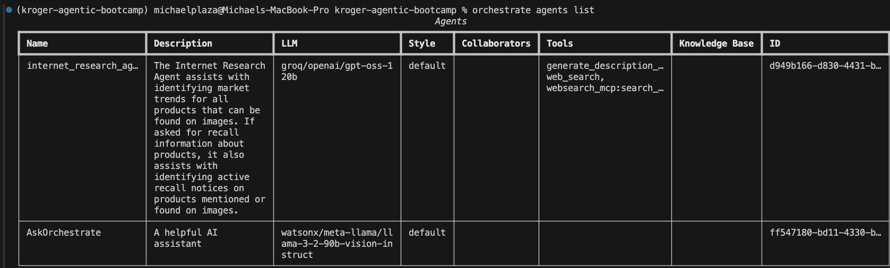

In the example above, the name of the agent is `internet_research_agent_9292aQ`.
To export, simply enter the following command on the command line (replace the name of the agent after the '-n' parameter with the name of your agent):
```
orchestrate agents export -n internet_research_agent_9292aQ -k native --agent-only -o internet_research_agent.yaml
```
Feel free to study the content of the created YAML file. It has all the same content as what we typed into the Agent Builder UI before. Another interesting detail is the `llm` section. It shows which model is being used by this agent. If the agent you are creating does not perform to your satisfaction, you may want to try a different model.

### The Ticket Manager Agent
Next let's create an agent from existing catalog agents within watsonx orchestrate. 
Go back to the Manage Agents page. And click on the 'Create Agent +' button.


Navigate to the `Start with Template` tab. This will open the catalog of existing agents and tools within watsonx orchestrate. We will be using the pre-made ServiceNow agent to create this new Ticket Manager agent.
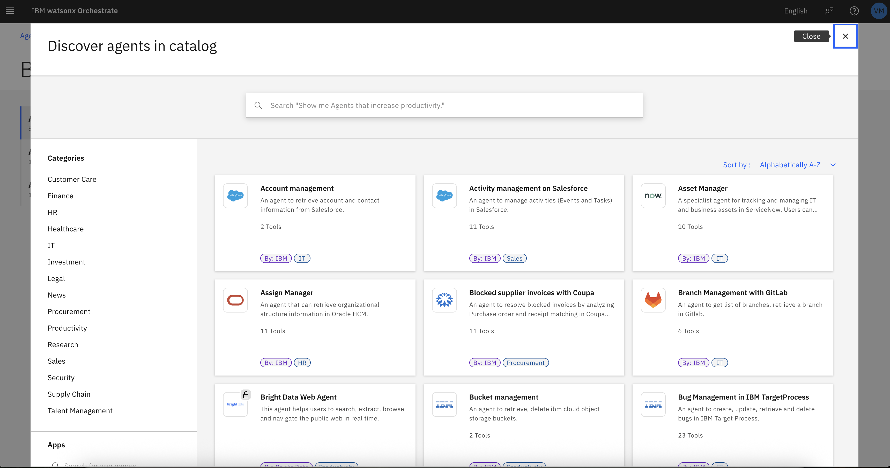

Search for ServiceNow in the search bar and scroll down to the Ticket Manager Agent


Click on the Ticket Manager Agent and then click on Use as Template. These agents are ready to use agents that can also serve as templates if you need specific functionality within your connections, apps etc. For the purpose of this lab, we will not be editing this agent at all, however depending on your use case you can edit every single detail within this agent. 


Click on Deploy and scroll down to Connections. Click on the edit pencil icon next to the service not connection if the connection status shows as not connected.
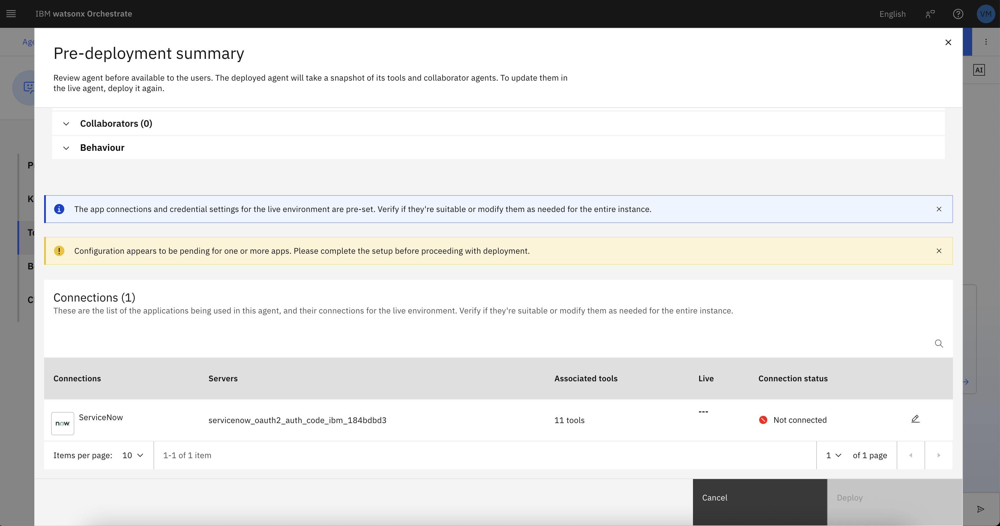

Choose Oauth2 for Authorization and member credentials and enter your details for the connection. Click on save changes and now you should be able to deploy your agent.


Now you have a prebuilt catalog agent that you would be using along with the other Agents we create for this usecase.


### The Market Analyst Agent

Next we will define the `Market Analyst Agent`. Unlike in the previous examples, we will simply import [a YAML file](./src/agents/market_analyst_agent.yaml) that includes all the settings for this agent. Let's take a look at the content of that file:

```
spec_version: v1
style: default
name: market_analyst_agent
llm: watsonx/meta-llama/llama-3-2-90b-vision-instruct
description: >
  The Market Analyst Agent makes recommendations for product shelf rearrangement based on a description of the existing shelf, and on market trends for the product.
instructions: >
  Persona:
    - Your purpose is to make recommendations based on product market trends and recommendations. I will give you product market trends and a description of a current product shelf , and you will create recommendations for the potential rearrangement of the products.

  Context:
    - You are used for product shelf arrangement based on market trends.
hidden: false  
```

Note that the `instructions` section has a similar structure to the one in the internet research agent, but it is missing the reasoning part, because there are no additional tools this agent can use. 

We can import the agent into our watsonx Orchestrate instance by entering the following command:
```
orchestrate agents import -f ./usecases/retail/src/agents/market_analyst_agent.yaml
```

Once imported, we can see and test the agent in the UI. Go back to your browser and click on the `Manage agents` link.

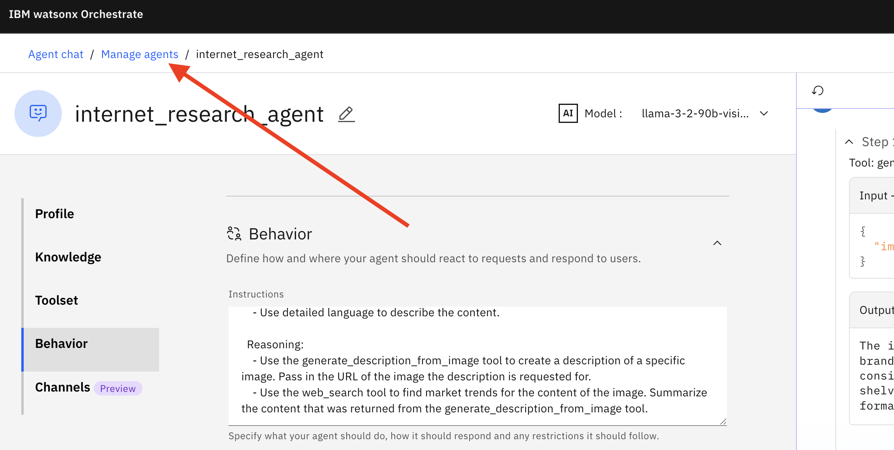

The new agent is now listed next to the first two agents we deployed. Instad of testing this new agent individually, we will go ahead and define (and then test) the supervisory agent that puts it all together.

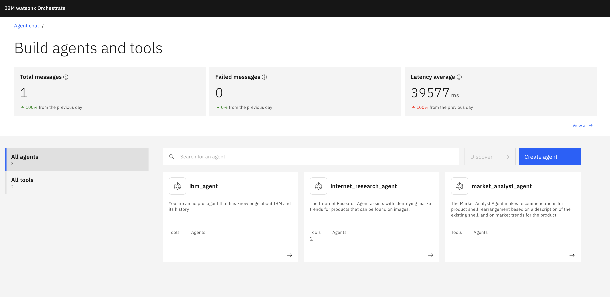

Note how the test invocation we ran earlier is reflected in the `Total messages` section of this page. We will take a closer look at it later.

### The Retail Market Agent

This agent is the user-facing agent, so to speak, that all requests go to. It will engage the other agents to address the task at hand. 
We will import it the same way as the previous agent, namely by [YAML file](./src/agents/retail_market_agent.yaml). But let's first take a look at the content of that file:
```
spec_version: v1
style: default
name: retail_market_agent
llm: watsonx/meta-llama/llama-3-2-90b-vision-instruct
description: >
    The Retail Market Agent assists with identifying market trends for products that can be found on images, and deriving recommendations for rearrangement of products based on those trends. It also let's you know if there are any recall orders on a product or on any of the products in the image provided.
instructions: >
  Persona:
  - Your purpose is to show me market trends for products based on an image, and make recommendations for the rearrangement of those products. I will give you an image with product on it, and you will analyze the image, do a search for market trends for the products in the image, and give me a set of recommendations for the potential rearrangement of the products on the shelf. I may also give you the name of a product to find if there is a recall order on it and you need to inform me of any active recall notices on the product and when it was issued and ask and create a ServiceNow Ticket for the recall notice.

  Context:
  - You are used for market trend research and analysis based on image descriptions.
  - You also get recall notice information and create tickets for the recall based on product names.
  - Use detailed language to describe the trends, recommendations and suggested actions for market trend research and active recall notice and issuance date for recall notices.

  Key Instructions on how to use tools and agents available to you:
  - Use the internet_research_agent agent and retrieve active recall notices on products from internet search based for the product name or image provided. After providing recall information, ask the user if they want to create a ServiceNow ticket for the product recall.
  - Use the internet_research_agent agent to retrieve market trends based on an image reference.
  - Use the market_analysis_agent agent to develop suggestions for rearrangement based on market trends and the current arrangement of products on the shelf.
  - If the user wants to create a ticket, Use the Ticket Manger agent (ticket_manager tool) to create a new ticket. Pass an input_message containing short description: ... and description: ... to the ticket_manager tool. Once the ticket is created, let the user know that a recall order has been placed on ServiceNow. 
```

Note how the 'Key Instruction' section contains details about how to use other agents, depending on the task at hand. We will add the related agents using the UI below.

We import this agent just like the previous one:
```
orchestrate agents import -f ./usecases/retail/src/agents/retail_market_agent.yaml
```

Back in the `Manage agents` view in the UI, you can reload the page and see the new agent listed next to the other ones.

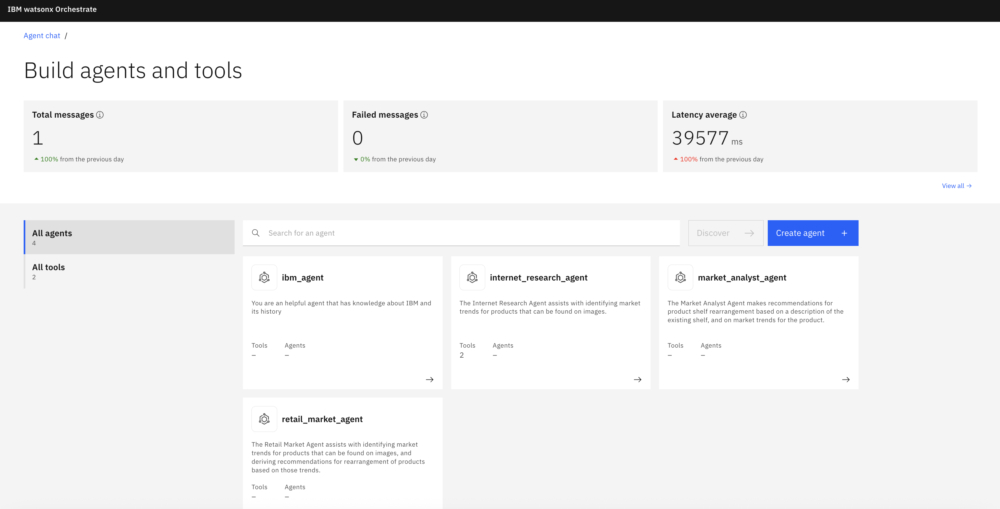

Click on the `retail_market_agent` tile to open the configuration of the agent we just imported. On the details page, scroll down to the "Agents" section and click on `Add agent`.

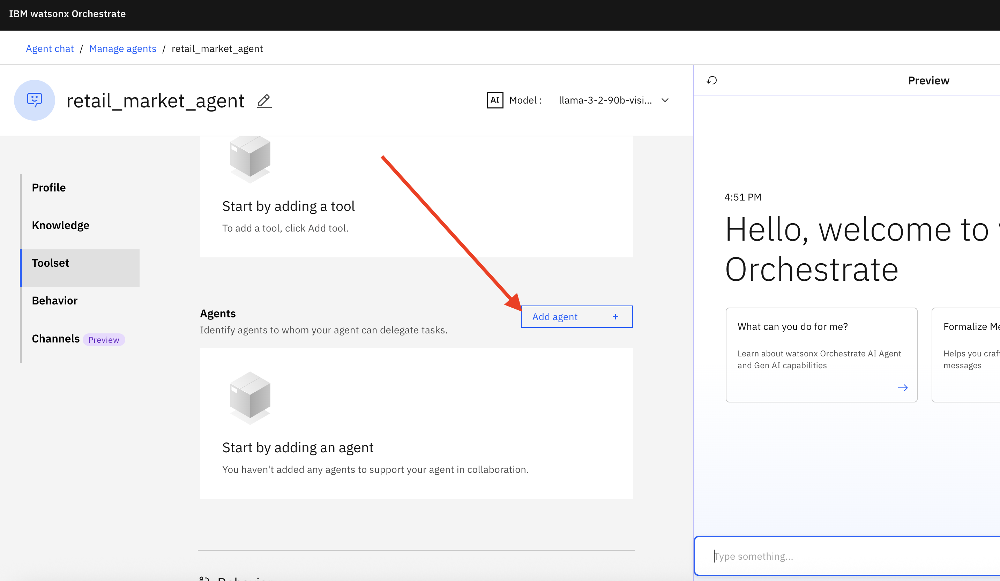

In the following dialog, select `Add from local instance`.

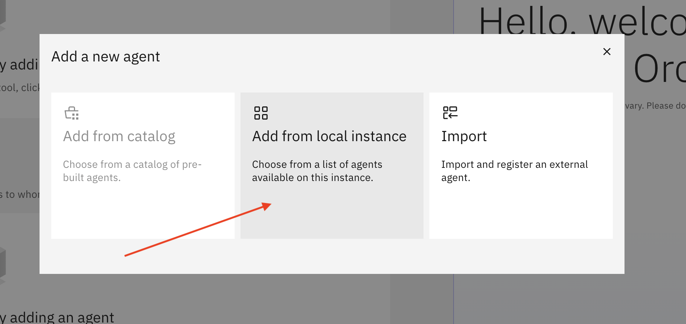

In the following page, select the three agents we defined earlier as collaborators, by checking the box next to them. Then click on `Add to agent`.

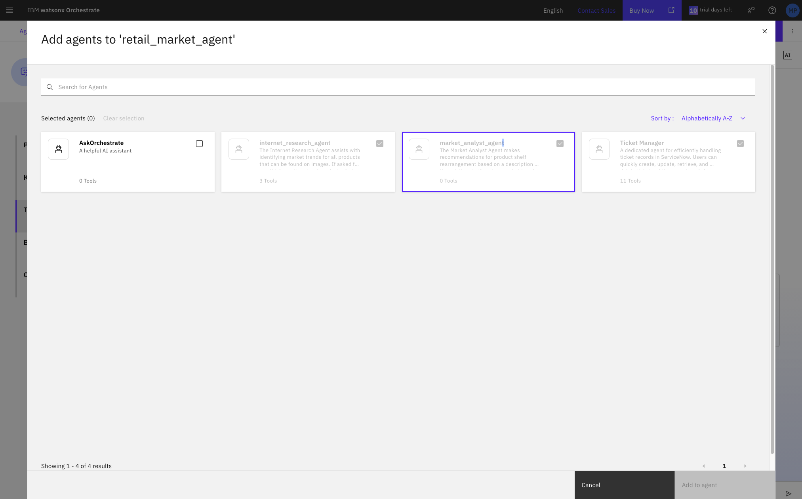

See how these agents have been added to the retail_market_agent. Remember that the instructions tell this agent when to involve them in addressing a task.

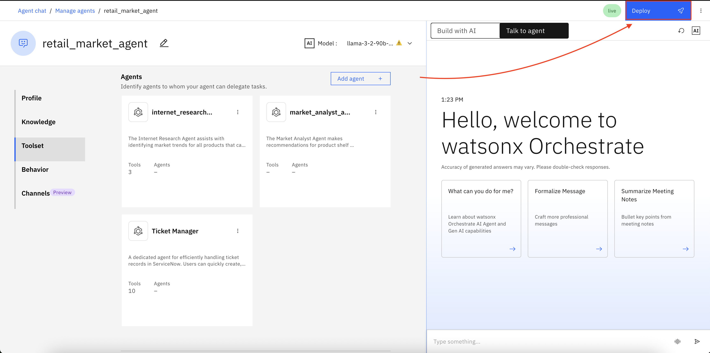

## Final test and Summary

Since you have successfully created all the tools and agents you needed, you can finally test the solution end to end. We want end users to only interact with the supervisory agent, so we will turn the `Show agent` flag off for both the internet_research_agent and the market_analysis_agent. To do so, go to the details page for the internet_research_agent, scroll down to the very bottom and turn off the switch.

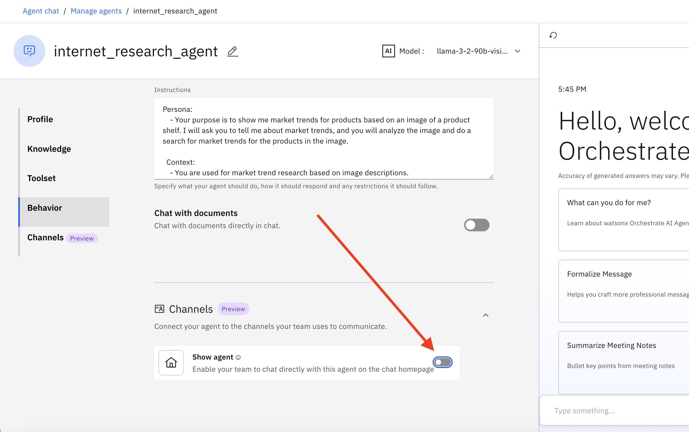

Repeat the same for the market_analysis_agent. Now click on `IBM watsonx Orchestrate` at the top left of the browser window to return to the main page.

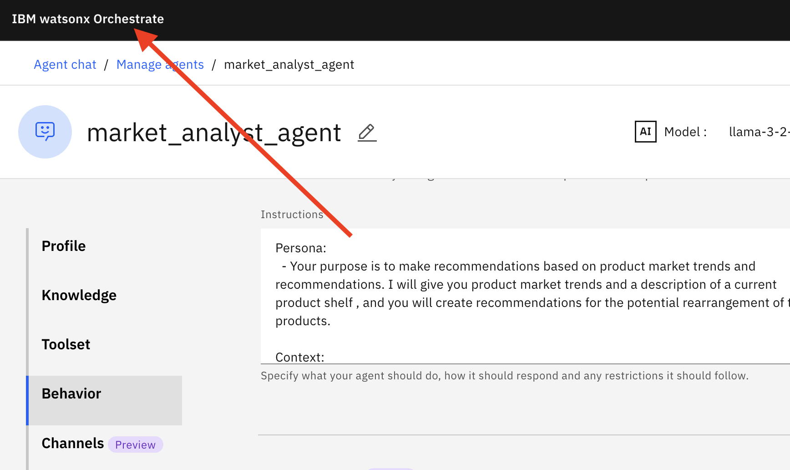

Note how in the main window, you are only offered two agents to chat with, namely the retail_market_agent and the ibm_agent that we imported at the very beginning. Which is exactly what we wanted, of course.

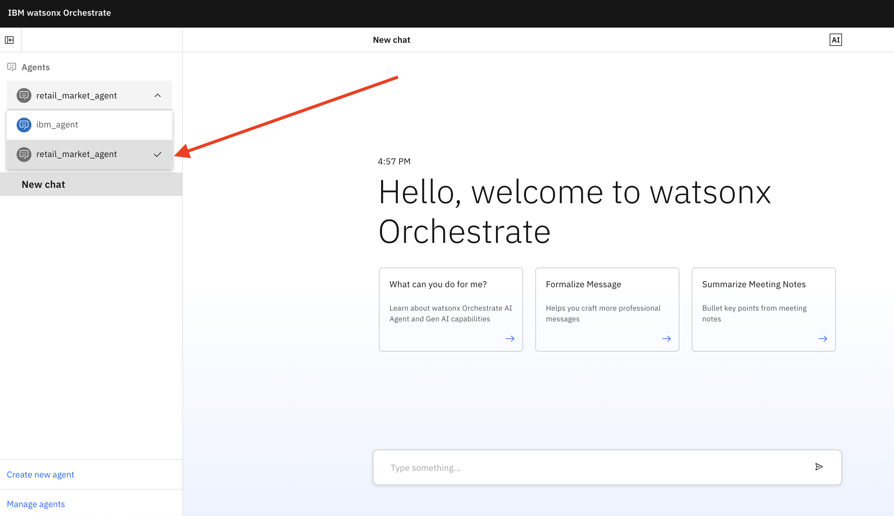

Make sure you have the retail_market_agent selected for the chat. Let's test the agent by entering the following into the chat:
```
Please look at the image at https://i.imgur.com/qfiugNJ.jpeg. Based on market trends for the products in the image, can you make recommendations for any rearrangement of the products on the shelf?
```

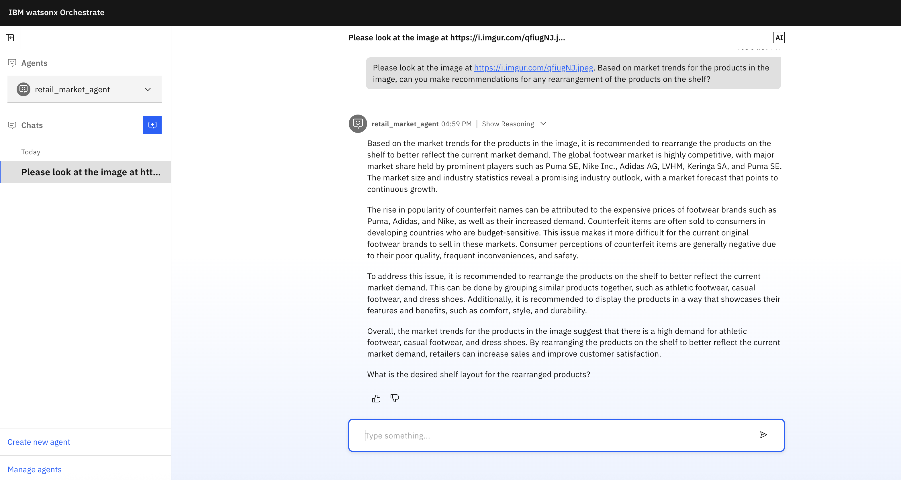

Voila! The supervisory agent used the collaborator agents to answer the user's question. One of the collaborator agents, namely the internet_research_agent, used two tools to convert the image into text and then do a web search for market trends.
Here are a couple more questions you can ask the agent:
```
Please look at the image at https://i.imgur.com/WzMC1LJ.png, and give me current market trends based on the products shown in the image. Based on those trends, can you make recommendations for the rearrangement of the products on the shelf?
```
```
How should the products shown in this image (https://i.imgur.com/Pb2Ywxv.jpeg) be rearranged given current market trends?
```
Let's do a two agent invoking flow:
```
Check if there is a recall notice on Spring & Mulberry chocolates?
```
Followed by (in response to "Would you like to create a ServiceNow ticket for the Spring & Mulberry chocolates recall?")
```
yes
```
Response to What priority would you like for the ticket?
```
1
```
This should have created a service now ticket for the recall notice in the instance you connected with the ticket manager.


Feel free to explore further, by changing descriptions and instructions, to see what the impact on the solution is.

## (Optional) Uploading the solution to a watsonx Orchestrate SaaS instance
The idea behind the ADK is to allow developers to create agentic solutions on their laptops and test them in a local environment. Once tests have completed, the solution can be pushed into a separate instance, including one that runs in the cloud. It uses the exact same CLI commands for doing so. And since we stored all of the agent and tool definitions in YAML files, we can run the entire process via the command line.

### Remote environment configuration
As a first step, you need to create a configuration for the remote environment. To a remote SaaS environment, you need to know its endpoint and its API key. You can find both on the resource page for your watsonx Orchestrate instance in the IBM Cloud console.

To find the endpoint URL, open the watsonx Orchestrate console and click on the profile button at the top right corner of the page. Then click on `Settings`:

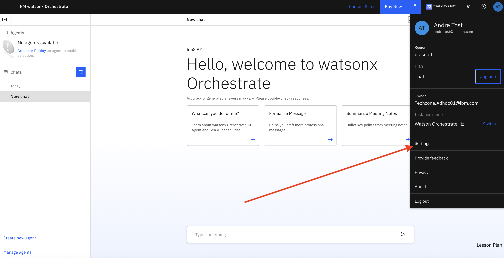

On the settings page, click on the `API details` tab.

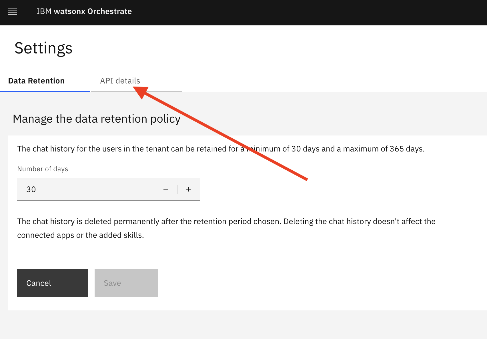

There you can copy the Service instance URL to the clipboard by clicking the icon next to the URL, as shown below:
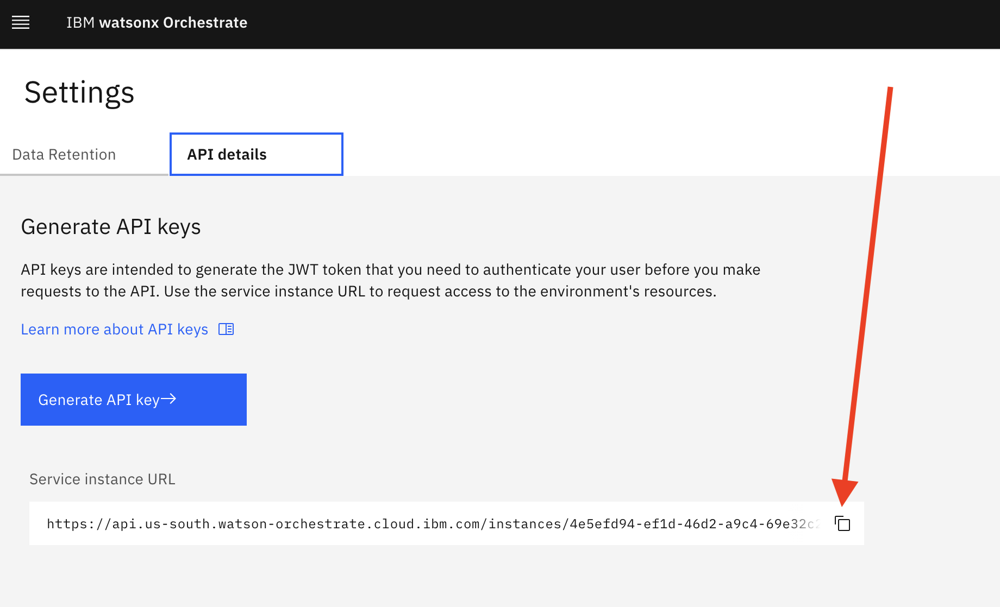

Now switch back to the command line and enter the following command on the command line:
```
export WXO_ENDPOINT=[copy the URL from the clipboard in here]
orchestrate env add -n wxo-saas -u ${WXO_ENDPOINT}
```
You should see a confirmation message like this:
```
[INFO] - Environment 'wxo-saas' has been created
```

If you run the command `orchestrate env list`, it will show you two environments, the local one and the remote we just added, with the local labeled as "active". Before we activate the remote environment, we have to copy the instance's API key.
Back on the API details tab of the Settings page, it will most likely not list any API keys (assuming this is a 'fresh' instance), but there is a button labeled `Generate API key`.

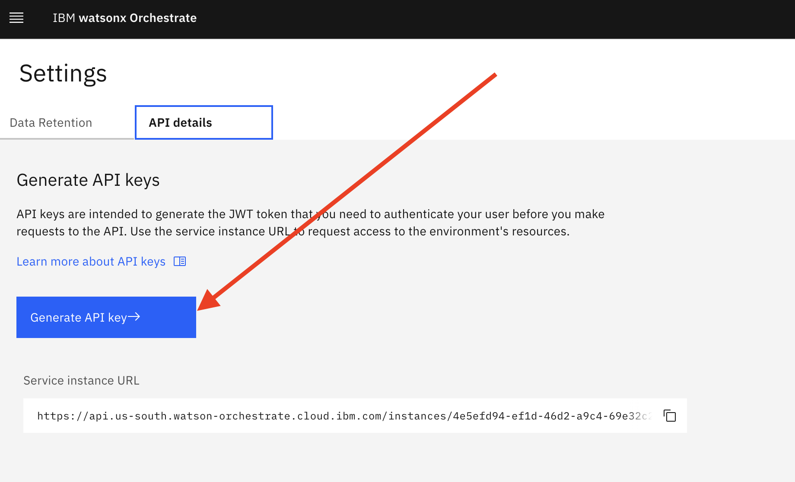

Click on that button to generate a key. This will redirect you to the IBM Cloud IAM API keys page. You may see one or more keys already generated (as shown on the picture below), but go ahead and create a new one for this exercise, by clicking on the `Create` button.

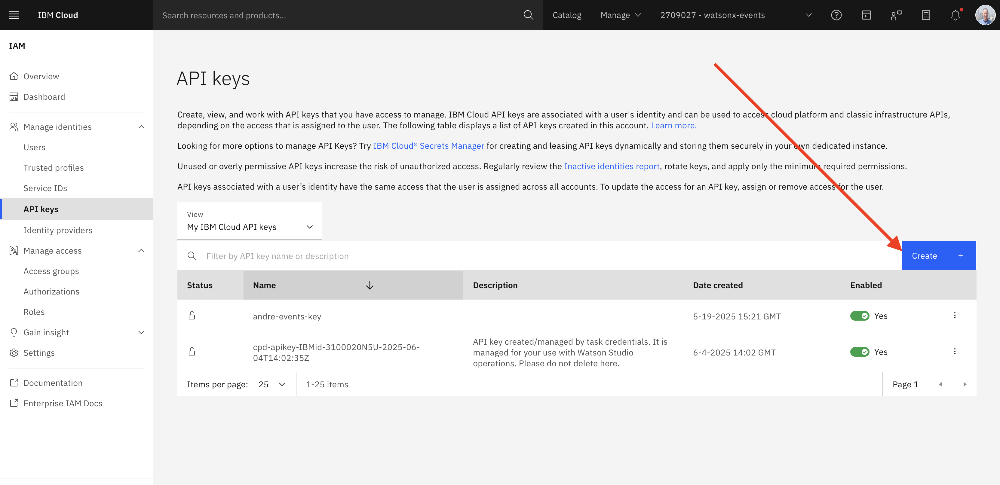

Give the new key a descriptive name and click on `Create` again.

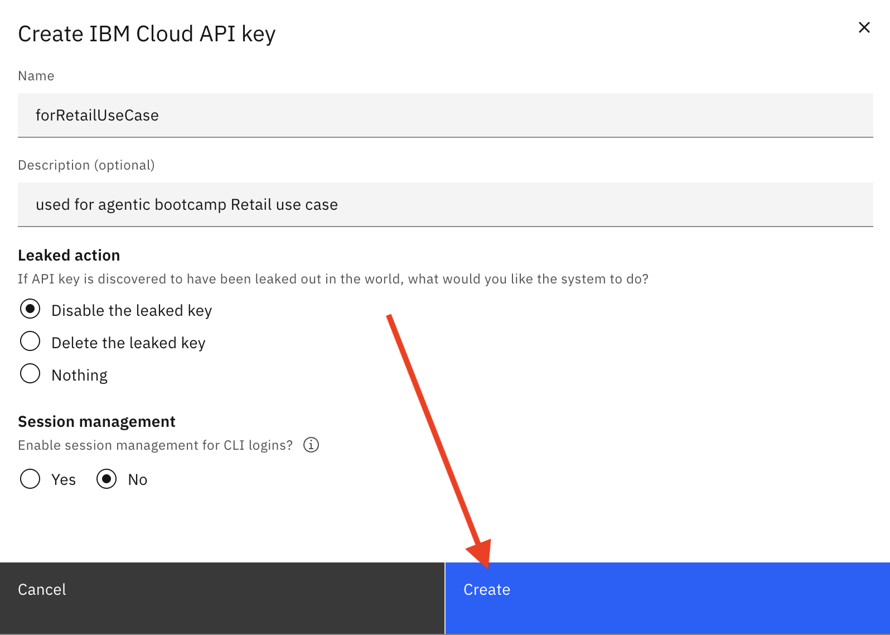

Make sure you copy the new key's value to the clipboard. 

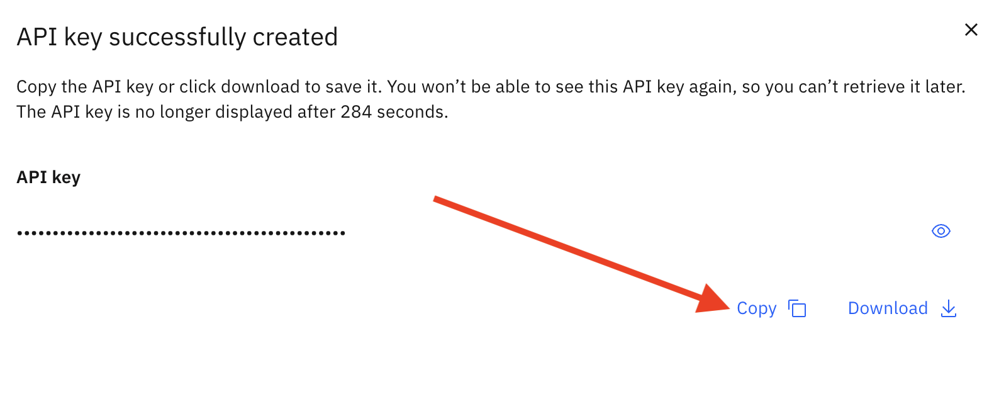

You may also want to copy it into an environment variable, in case you need to use it again later. You won't be able to look it up in the IBM Cloud IAM console after closing the window showing the `API key successfully created` message.
```
export myAPIkey=[copy the API key from the clipboard in here]
```

To activate the remote environment, simply enter 
```
orchestrate env activate wxo-saas
```
It will now ask you for the API key of your remote instance. You should still have it in the clipboard and can simply paste it here.

After entering the key and hitting Enter, you should get a message saying `[INFO] - Environment 'wxo-saas' is now active`.

A simple way to verify you can connect with the remote instance is to ask for any agents or tools it might contain, by using the `orchestrate agents list` and `orchestrate tools list` commands. In the example screenshot below, it shows as empty, but in your case it may list agents you created in a previous use case.


### Importing connections, tools and agents
Now we are ready to import the connections, tools and agents into the remote environment, reusing the definitions we created for the local instance. For convenience, you can find the commands in a [script](./src/import-all.sh) that runs the required steps:

```
#!/usr/bin/env bash
set -x

SCRIPT_DIR=$( cd -- "$( dirname -- "${BASH_SOURCE[0]}" )" &> /dev/null && pwd )

for connection in tavily.yaml watsonxai.yaml; do
  orchestrate connections import -f ${SCRIPT_DIR}/connections/${connection}
done

for python_tool in web_search.py generate_description_from_image.py; do
  orchestrate tools import -k python -f ${SCRIPT_DIR}/tools/${python_tool} -r ${SCRIPT_DIR}/tools/requirements.txt -a watsonxai -a tavily
done

for agent in internet_research_agent.yaml market_analyst_agent.yaml retail_market_agent.yaml; do
  orchestrate agents import -f ${SCRIPT_DIR}/agents/${agent} -a tavily -a watsonxai
done
```

So go ahead and enter `./usecases/retail/src/import-all.sh` on the command line.

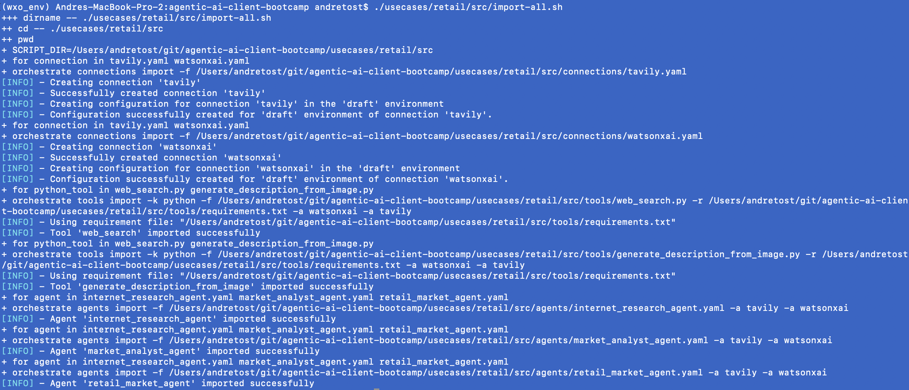

Now we you enter, for example, `orchestrate agents list`, you should see the agents listed.

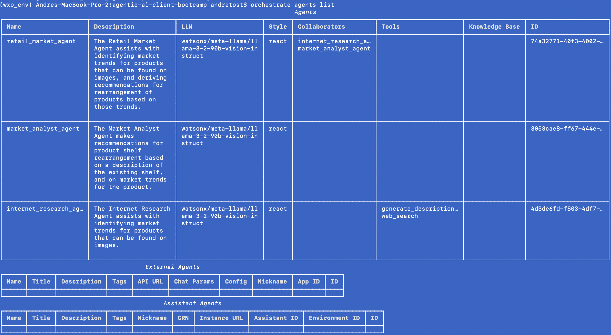

Before we can start testing, we also need to set the credentials in the connections, so that the tools can retrieve the correct API keys etc. We have automated this part into a separate [script](./src/set-credentials.sh):
```
#!/bin/bash

# Use default if no argument was passed
DEFAULT_TARGET_ENV="draft"
TARGET_ENV="${1:-$DEFAULT_TARGET_ENV}"

# Load variables from .env
set -o allexport
source .env
set +o allexport

# set the credentials
orchestrate connections set-credentials -a watsonxai --env "${TARGET_ENV}" -e "modelid=${WATSONX_MODEL_ID}" -e "spaceid=${WATSONX_SPACE_ID}" -e "apikey=${WATSONX_APIKEY}"
orchestrate connections set-credentials -a tavily --env "${TARGET_ENV}" -e "apikey=${TAVILY_API_KEY}"
```
Remember that the values for the credentials are retrieved from the .env file. This script also has a parameter controlling which environment is configured with values. As we mentioned above, the are two environments defined in each `Connection` we use, namely `draft` and `live`. The `live` environment was ignored when running against a local ADK instance, but we need it here. The `live` environment is used when running an agent that is in `deployed` state. We will deploy the agents below, but here, we just set the same values in both the draft and the live environment.

Enter the following on the command line.
```
./usecases/retail/src/set-credentials.sh draft
./usecases/retail/src/set-credentials.sh live
```

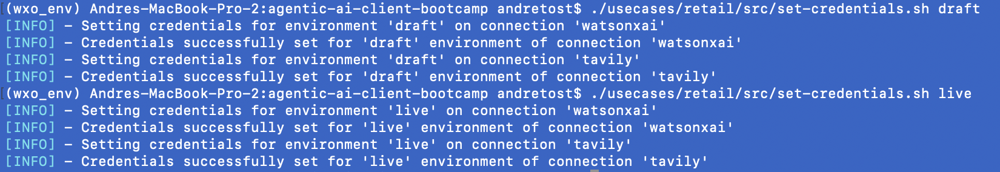

Let's test the agents in the SaaS instance now, to verify they work as expected. Open the watsonx Orchestrate console in your browser. You should still have a tab with the console open, from when we captured the service instance URL above. The easiest way to get back to the homepage is to simply click on `IBM watsons Orchestrate` in the top left of the window.

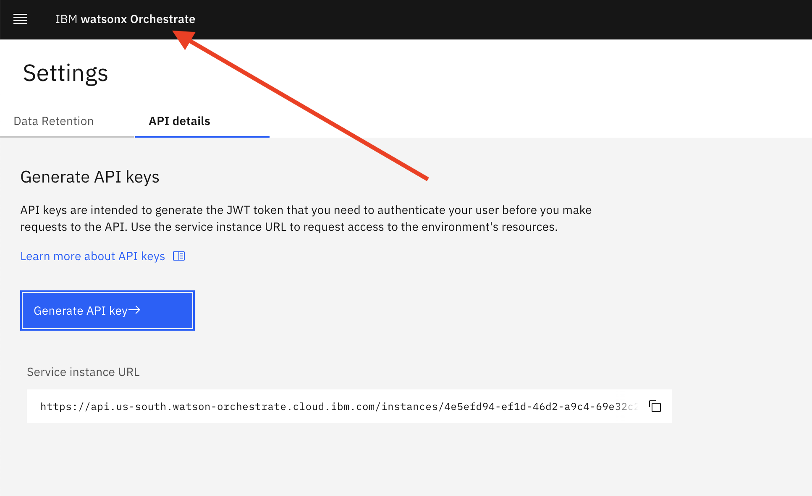

On the homepage, you will not see the new agents available for chat. The reason is that in order to become visible there, we have to "deploy" the agents. Click on the `Manage agents` link at the bottom left of the page.

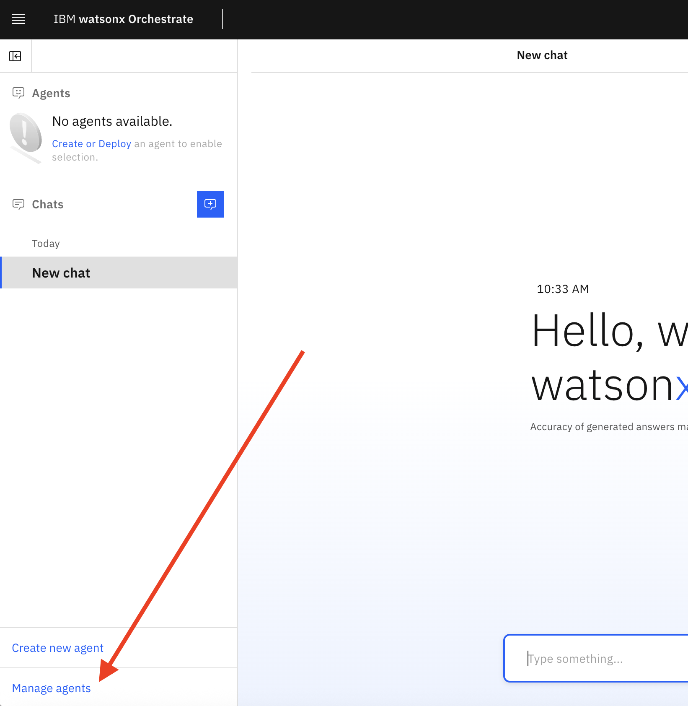

All three agents shoud be listed there. Let's start with the internet_research_agent. Just click on its tile to open the details view.

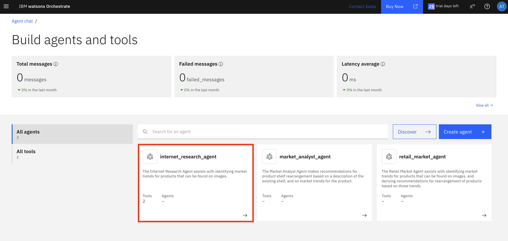

We can test this agent right here in the preview, just like we did before when running locally. You can test it by entering, for example, the following text into the Preview tet field:
```
Can you show me market trends for the products shown in the image at https://i.imgur.com/WzMC1LJ.png
```

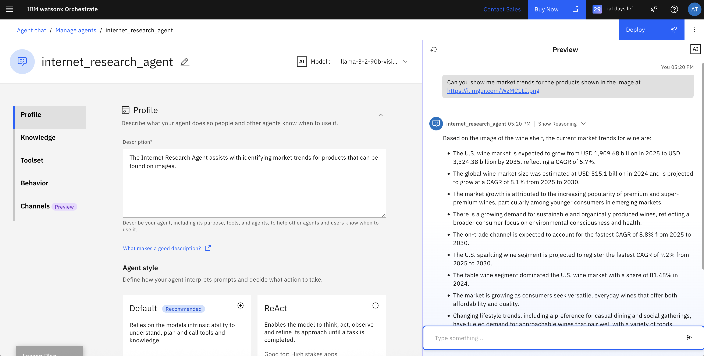

Assuming the results are satisfactory, let's deploy the agent by clicking on the `Deploy` button at the top right of the page.

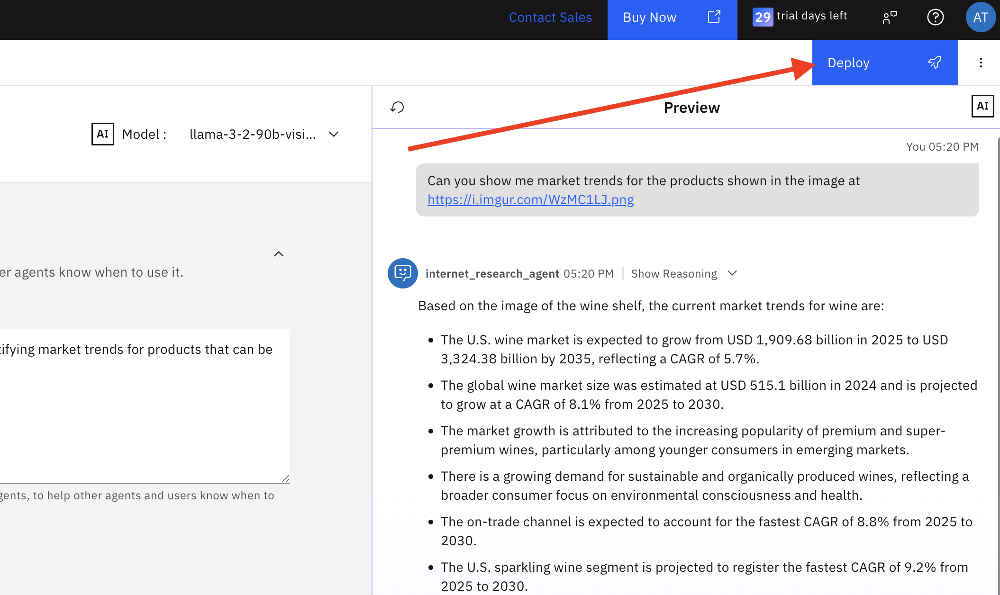

Note how in the following screen, the connections we are using are listed here. Click on `Deploy` again.

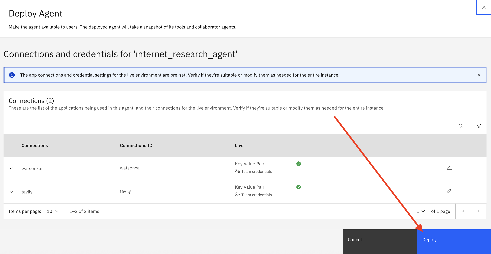

Once the agent is deployed, go back to the `Manage agents` page by clicking on the associated link at the top of the page.

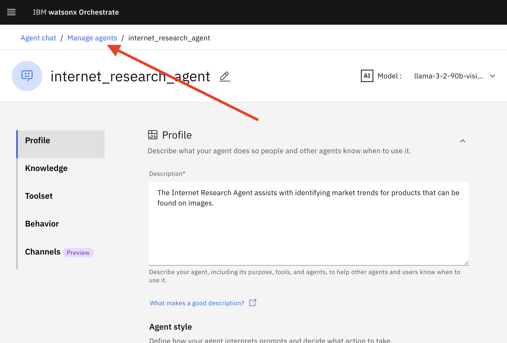

Now repeat the same exercise with the `market_analyst_agent` and the `retail_market_agent`. However, for the `retail_market_agent`, you also need to add the two agents as collaborators, just like you did when using the ADK earlier.

We won't show detailed steps and screenshots here, because we are confident that by now, you are an expert in navigating the tool. 

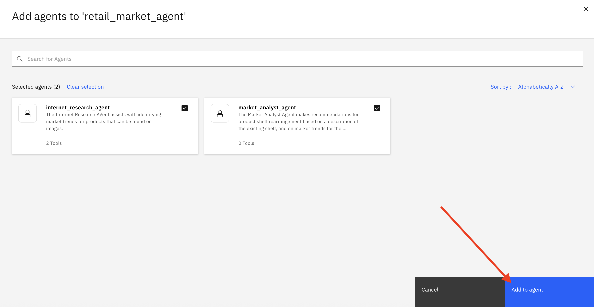

Once you have deployed all three agents, they should all show the `Live` icon.

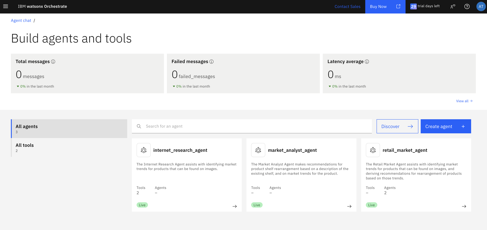

Finally, let's go back to the homepage and run the solution there. On the homepage, make sure you have selected the `retail_market_agent` in the Agents drop-down list, since that is the agent we want the user to chat with.

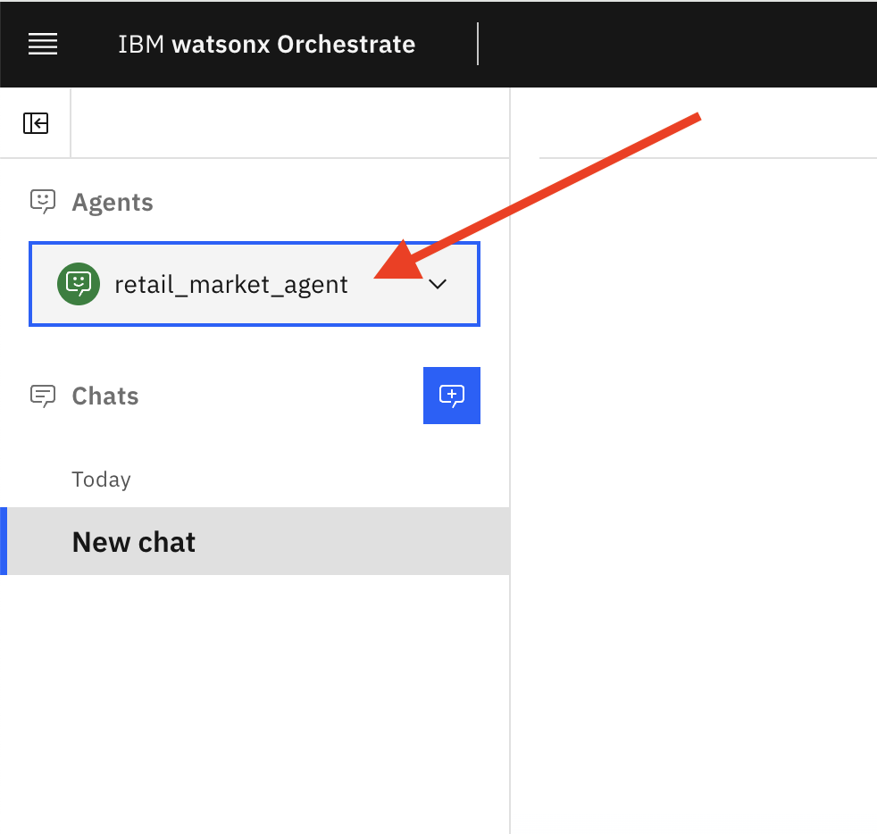

Remember that you control which agents show up in this list by checking or unchecking the `Show agent` flag in the agent details page.

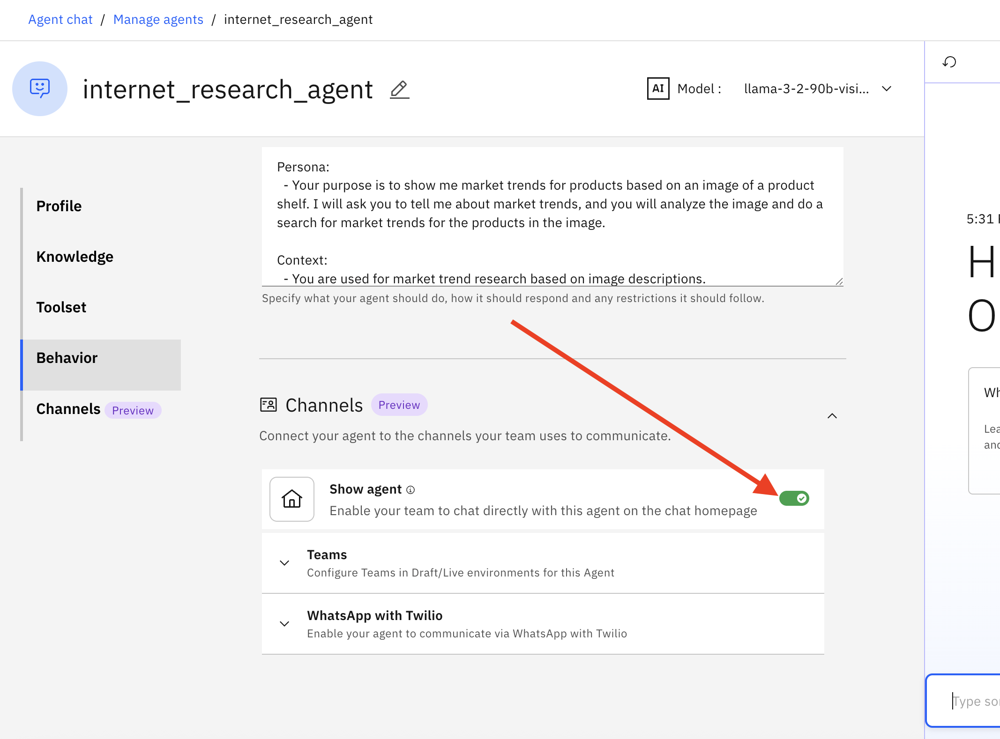

In the main chat window, let's enter the following prompt to see if the agents are working as expected. We'll simply reuse a prompt from our tests on the local instance.

```
Please look at the image at https://i.imgur.com/qfiugNJ.jpeg. Based on market trends for the products in the image, can you make recommendations for any rearrangement of the products on the shelf?
```

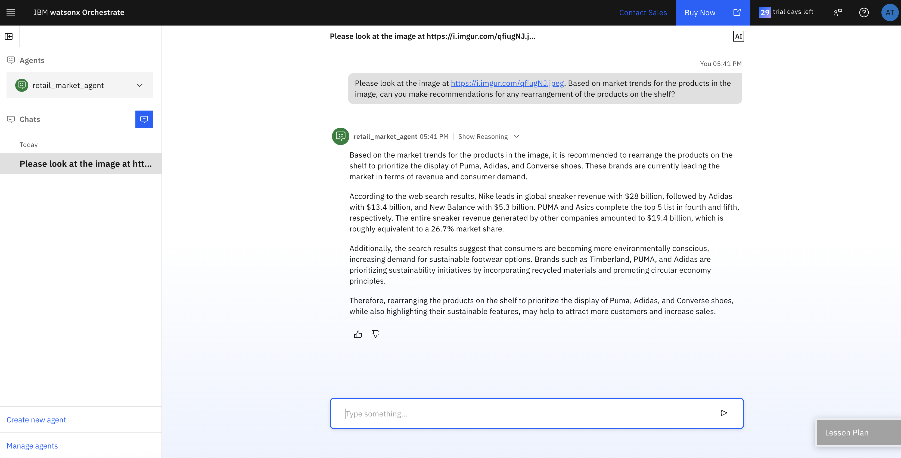

Feel free to run more experiments, switching the target environments the CLI is using between `local` and `wxo-saas` to see if the two environments behave differently. 

## (Optional) Headless Agent

In this section, we will use the agents above in a "headless" form. That is, the agent is triggered not by a human typing into a chat window, but by an event. "Event" in this context can be represented by a number of concrete implementations: for example, receiving a message through a pub/sub system, sent by a sensor, triggered by an incoming email, triggered by a stock price dropping below or rising above a certain level - the possibilities are endless. What they all have in common is that the agent is always on, listening and waiting for the event to occur, and then acting on that event, without any human intervention.

The example scenario we will walk through here is one where a new photo of a product shelf is taken, stored in a folder in the cloud, and the appearance of that file will trigger the agent to download the image and create rearrangement recommendations. And to make things practical, instead of uploading the picture to a cloud store, we will show you an application that watches a file folder on the local machine, and will invoke the agent running in the ADK locally whenever a new image file appears. The result of the agent's work, i.e. recommendations for how to rearrange the product shelf, will be stored in a text file.

### Code Walkthrough

 > Note: the code for the app is in the file [image_listener.py](./src/app/image_listener.py).

To implement the headless agent, we need an application that calls the Retail Market Agent using the watsonx Orchestrate REST API, and specifically, the "Caht with Agents" API. You can see the spec for this API [here](https://developer.watson-orchestrate.ibm.com/apis/orchestrate-agent/chat-with-agents). 

For our app, we need three parameters:

1. **The Bearer token**

This token has to be sent as part of the header in the HTTP POST request. For a locally running ADK instance, you can find it in the `~/.cache/orchestrate/credentials.yaml` file, under `auth -> local -> wxo_mcsp_token`. 

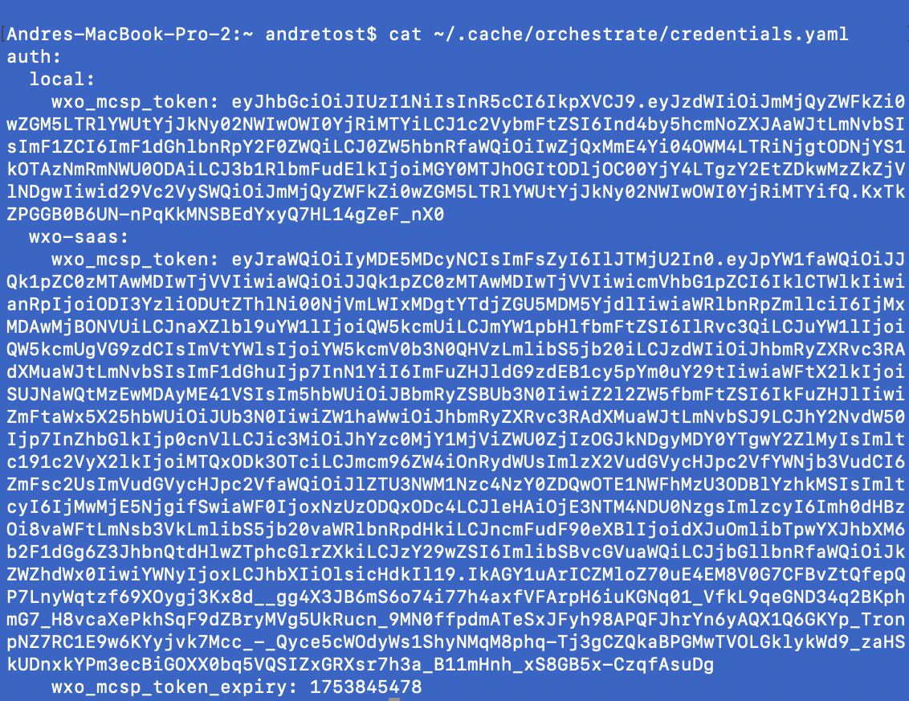

Note in the screenshot that ths file has two tokens, one for the local environment and one for the SaaS environment that we set up in the previous section. We will only use the local one here. Since we are passing it to the application as a parameter later, you might want to copy it from the file into your clipboard, and then store it in an environment variable for later use.

```export BEARER_TOKEN=eyJhbGciOiJIUzI1NiIsInR5cCI6IkpXVCJ9...```

2. **The agent ID**

Every agent created in watsonx Orchestrate has an ID, which is used as an identifier in the target URL of the REST API. So we need to find the ID of the `retail_market_agent` agent, which can be done by using the `orchestrate agents list --verbose` command. The command returns a detailed list of all defined agents in JSON format. One of the fields is labeled `id`, and that is the one we need.

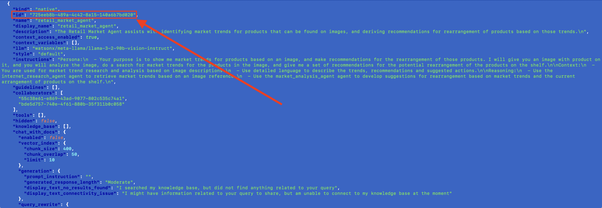

We will pass this as a parameter as well, so copy it to the clipboard and from there to an environment variable for later use.

```export AGENT_ID=725eeb8b-489a-4c42-8a15-140a6b7bd020```

3. **The target folder**

As mentioned above, the app will watch for the creation of new image files in a specific local folder. With this parameter, you specify which folder you would like to use. The app will not only look for image files in that folder, it will put the reults of the agent invocation into a text file in a subfolder named `output`.

```export TARGET_FOLDER=/Users/andretost/retail-images```

At the start of the program, it will collect the input parameters passed in and store them in local variables for later use.

```
if __name__ == "__main__":

    parser = argparse.ArgumentParser(description="Process an image file with an AI agent.")
    parser.add_argument("--agent_id", required=True, help="The ID of the target agent.")
    parser.add_argument("--target_folder", required=True, help="The base folder for images and responses.")
    parser.add_argument("--token", required=True, help="The bearer token of the local instance.")
    args = parser.parse_args()

    agent_id = args.agent_id
    url = f"http://localhost:4321/api/v1/orchestrate/{agent_id}/chat/completions"
    watched_folder = args.target_folder
    bearer_token = args.token
```
Note how the target URL for the REST call to the ADK instance has the agent ID embedded into it.

Next it sets up an `Observer` and a `FileEventHandler`. The combination of both allows us to start watching for events related to the defined target folder. This is all we need in the "main" part of the program.

```
    event_handler = NewFileHandler()
    observer = Observer()
    observer.schedule(event_handler, path=watched_folder, recursive=False)

    print(f"Watching folder: {watched_folder}")
    observer.start()
    try:
        while True:
            time.sleep(1)
    except KeyboardInterrupt:
        print("Stopping observer...")
        observer.stop()
    observer.join()
```

Now we will look at the implementation of the event handler class, i.e. the code that is called when a new file is added to the target folder.

```
class NewFileHandler(FileSystemEventHandler):
    def on_created(self, event):
        if not event.is_directory:
            file_path = os.path.abspath(event.src_path)
            filename = os.path.basename(file_path)
            ext = os.path.splitext(file_path)[1].lower()
            # Only process image files
            if ext not in [".png", ".jpg", ".jpeg"]:
                print(f"Ignored file (unsupported type): {file_path}")
                return

            print(f"New file detected: {file_path}")
```

It reacts to the `on_created` event, determines the name of the new file, and will only continue to process it if it is a jpeg or png file.

#### The local HTTP server

Remember that when we set up the agents for this use case, we assumed that the location of the image is passed as a URL. For example, one of the test prompts you used above was: 
```
Please look at the image at https://i.imgur.com/qfiugNJ.jpeg. Based on market trends for the products in the image, can you make recommendations for any rearrangement of the products on the shelf?
```

So here we need to convert the filename into a URL that the agent can retrieve. For this, you need to start a local HTTP server. This will allow retrieving local files - including the image files we are interesed in here - through an HTTP GET request. The easiest way to do so is to simply run the following command in (a) a new command terminal (since it will be blocked), and (b) running the command below **in the target folder** where your images are going to be stored.

```
python -m http.server 8001
```

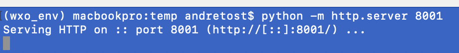

You can test it by opening a browser window with `localhost:8001` as the address. It should show a file listing of your target folder. We assume it is empty for now, but even if there are files in there, remember that we are looking only for new files in our program, any existing files will simply be ignored.

Another interesting element is that the tool that is interpreting the image is running inside the ADK instance, in a Docker container. Inside the container, the hostname "localhost" will not point to the hostname of your machine, it will be the container's local IP address. To reach the HTTP server we just started, we have to use the address `host.docker.internal`, because that maps to the hostname of your actual computer.

```
            try:
                file_url = f"http://host.docker.internal:8001/{filename}"
                payload = {
                    "stream": False,
                    "messages": [
                        {
                            "role": "user",
                            "content": f"Please look at the image at {file_url}, and give me current market trends based on the products shown in the image. Based on those trends, can you make recommendations for the rearrangement of the products on the shelf?"
                        }
                    ]
                }

                response = requests.post(
                    url,
                    headers={"Content-Type": "application/json", "Authorization": f"Bearer {bearer_token}"},
                    data=json.dumps(payload)
                )
                status = response.status_code
                result = response.json()
                text = result["choices"][0]["message"]["content"]
                print(f"POST response: {status} - {text}")
```

In the above, you see that we use the filename of the new file and append it to `http://host.docker.internal:8001`. That will allow the tool running inside the container to retrieve the file.

That URL is then inserted into the prompt as a variable. Otherwise this is the same prompt we would enter into the Chat UI, just in this case it is sent as a message within the REST call. The agent will start its work and return the result in the response message.

```
                answer = f"""
New File Processed: {os.path.basename(file_path)}

Response: {text}
"""
                save_text_to_responses_file(answer, image_filename=filename)
```

The returned message is embedded into a piece of text, and then saved into the output file. The saving happens in a function called `save_text_to_responses_file()`, which is pretty straightforward Python code and we will not print it out here separately. Again, you can see the entire Python code for the program in [this .py file](./src/app/image_listener.py).

#### Running the app

It's now time to run the application and test it! You have saved the three parameters it requires as environment variables above, so you can call it right away:

```
python ./usecases/retail/src/app/image_listener.py --agent_id $AGENT_ID --target_folder $TARGET_FOLDER --token $BEARER_TOKEN
```

Now let's copy an image file into the target folder. You can use any of the files in the [./usecases/retail/src/app/images/](./src/app/images/) folder for this test. Copy an paste the file either using your File Explorer or run a `cp` command in a separate command terminal - either will do the trick.

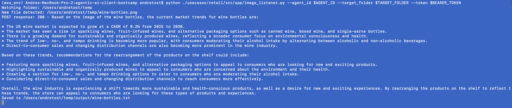

Note how the program runs in an endless loop, and you can add more image files to the target folder. To stop it, simply hit ctrl-c. You can also see the file that was produced in the `output` folder.

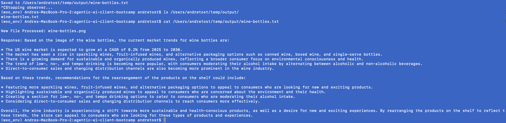
