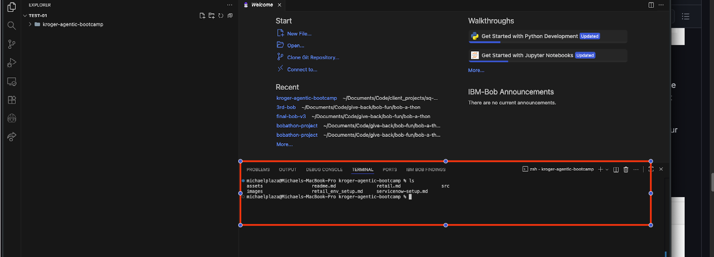
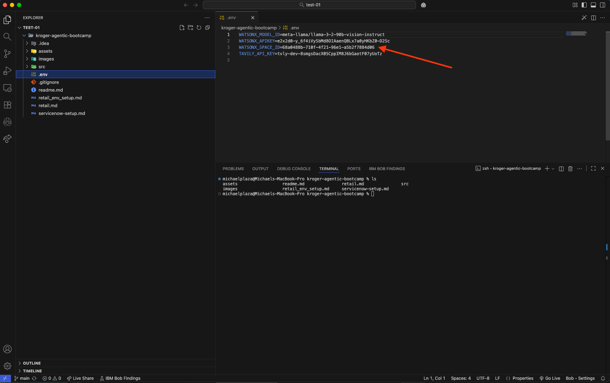
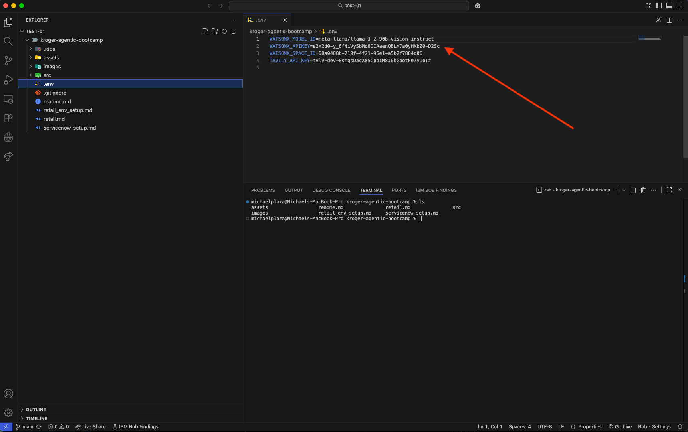
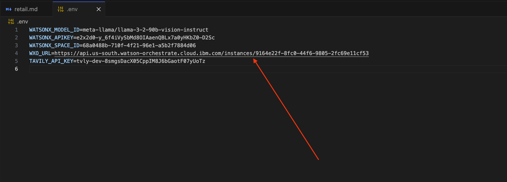

# Setup for the Retail use case lab
- [Introduction](#introduction)
- [Lab materials](#lab-materials)
  - [Local machine](#local-machine)
  - [Windows Users](#windows-users)
    - [IBM Bob](#ibm-bob)
- [Environments](#environments)
  - [watsonx.ai](#watsonxai)
    - [The .env file](#the-env-file)
    - [API key](#api-key)
    - [WXO Service URL](#wxo-service-url)
  - [watsonx Orchestrate ADK](#watsonx-orchestrate-adk)
    - [Local machine](#local-machine-1)
  - [watsonx Orchestrate](#watsonx-orchestrate)
  - [Tavily](#tavily)
  - [ServiceNow Set up](#servicenow-set-up)

## Introduction

This document contains the documentation for the setup of the environment to prepare for the step-by-step walkthrough of the Retail use case.

The use case takes you through the creation of tools and agents using the [IBM watsonx Orchestrate Agent Development Kit (ADK)](https://developer.watson-orchestrate.ibm.com/). This toolkit can be installed on a local machine, and accessed through a CLI.

## Lab materials

The materials for this lab will be given to you by your instructor in the form of a zip file. You need to unzip this file into a folder on your machine. The file contains a set of markdown files that represent the instructions for various parts of the bootcamp (including this very file), as well as code samples that you are going to use. Where to unzip the file differs based on whether you are running this lab on your local machine or on a virtual machine provided to you.

### Local machine

In this case, you can choose any folder as the base for the material. You should use that same folder as the current directory when installing the ADK (which is described in more detail [below](#watsonx-orchestrate-adk)). After unzipping, listing the files in a command terminal should look like shown below (this screenshot is taken on MacOS):



### Windows Users
If you are running locally on a Windows machine, please install the appropriate version: https://git-scm.com/install/windows. This will be used to run bash scripts needed in the lab. 

#### IBM Bob
We recommend you use IBM Bob to view the materials and edit files as needed. Assuming you have the command line starter installed, you should be able to start IBM Bob right from the command line by entering `bobide .`.


## Environments

To run the lab end to end, you need a number of environments.

### watsonx.ai

For the lab, as well as for the install of the Developer's Edition of watsonx Orchestrate, you will need access to an IBM watsonx.ai Runtime instance, and specifically, a `deployment space ID` for that instance as well as an `API key` for the IBM Cloud account the instance is running in. 

Your instructor should have given you access to the instances of watsonx Orchestrate and watsonx.ai that you will use throughout the bootcamp. To access them, you start out by logging into your IBM Cloud account at https://cloud.ibm.com. You can find the resources that you have access to in that account when going to the so-called "hamburger menu" on the top left of the page and clicking on `Resource list`.


On the page with all your resources, you can find your watsonx.ai Runtime instance in the `AI / Machine Learning` section. The instance will have `watsonx Runtime` in the Product column. Click on the name of the instance.


This will open the details page for the resource. Expand the `Launch in` drop-down list and click on `IBM watsonx`.


After opening the watsonx console, you can close both the Welcome and the Dive deeper pop-up windows. Now, click the 'hamburger menu' on this page, again at the top left of the page, and select `View all deployment spaces`.


In the following view, depending on whether you have already run a different lab, you may or may not see any deployment spaces listed. However, here we will just create a new one. Click on the `New deployment space` button.


Give the new space a descriptive name. All other fields are optional. The `Storage` field should already be filled in. Click on `Create`.


Once the space is ready, click on `View new space`. 


On the details page for the new space, select the `Manage` tab.


On the Manage page, make sure the space is associated with your watsonx.ai Runtime instance, and set it if it is not. (Hit Save if you need to set it.)


The last step here is that we need to capture the Space GUID. You can find the GUID also on the Manage tab. Simply click on the icon next to it to copy it to your clipboard.


#### The .env file

The Space GUID, as well as a number of other environment variables, goes into a file called `.env`. This file should exist in **the root folder** of where you extracted the content of the repo that was provided to you by your instructor (this file is also in that repo, of course), in other words, it should be at the same level as the `usecases` or `environment-setup` subfolders. 

Start by copying the `.env.sample` provided to you into a .env file with the following command:
```
cp .env.sample ./.env
```

- If you are running this on your local machine, you should have already unzipped the file with materials into a folder of your choosing, as described [above](#local-machine). Create an empty .env file and make sure you place the `.env` file in that same folder. 

You can edit the file with an editor of your choosing. We recommend using IBM Bob for this. 

Add the Space GUID value that you captured above to the `WATSONX_SPACE_ID` variable.



#### API key

You also need an API key for the IBM Cloud account that your watsonx.ai instance is on. To obtain one, open the IBM Cloud console (https://cloud.ibm.com) as before and select `Access (IAM)` option from the `Manage` dropdown at the top of the page.


On the following page, select `API keys` from the menu on the left.


You may or may not already have an API key listed, and if so, feel free to use it (note that you cannot see the value of an existing API key after you initially created it). Or you can simply create a new one by clicking on the `Create` button.


Give the new key a descriptive name, and click on `Create`.


Once the key has been successfully created, make sure you copy its value to the clipboard by clicking on the `Copy` link. As mentioned above, you won't be able to retrieve this value later.


The API key also goes into the .env file, add it to the `WATSONX_APIKEY` variable.



#### WXO Service URL
Finally, you will need a url associated to your watsonx Orchestrate instance. Start by navigating to [IBM Cloud resources](https://cloud.ibm.com/resources), then click on the AI / Machine Learning drop down and select Orchestrate. 


Copy this `URL` and save it in your .env




### watsonx Orchestrate ADK

As mentioned above, the ADK allows hosting the core Orchestrate components on a developer laptop. For the lab, you can choose if you want to run the ADK on your own laptop or on a virtual machine that will be provided to you by your instructor. 

#### Local machine

To run it on your own laptop, you need to install:
- Python 3.11 + 
- IBM Bob (or similar editor)

For initial setup, we recommend the following steps, but if you want to use a different virtual environment manager please refer to the steps here: [the ADK install page](https://developer.watson-orchestrate.ibm.com/getting_started/installing)

##### Mac Setup
###### Step 1: Install homebrew
```
/bin/bash -c "$(curl -fsSL https://raw.githubusercontent.com/Homebrew/install/HEAD/install.sh)"
```
###### Step 2: Install uv with either:
```
brew install uv
```
or directly with a curl command:
```
curl -LsSf https://astral.sh/uv/install.sh | sh
```
###### Step 3: Set up uv venv:
```
uv venv --python 3.11
source .venv/bin/activate
```

##### Windows Setup


> If you'd like to to update your python version, or have different configurations, follow the steps [here](https://developer.watson-orchestrate.ibm.com/getting_started/installing) until you install the ibm-watsonx-orchestrate package.

Then run the following to install the ADK:
```
pip install --upgrade ibm-watsonx-orchestrate
```

If you have any issues, these instructions go more into detail: [the ADK install page](https://developer.watson-orchestrate.ibm.com/getting_started/installing)

### watsonx Orchestrate 

Your instructor will provision both the watsonx.ai and the watsonx Orchestrate instances for you and you can find the watsonx Orchestrate resource in the IBM Cloud resource list. This is only needed for the last part of the lab.

### Tavily

One of the tools you will create during the lab is a web search tool that takes advantage of a service called "Tavily". To use it, you need an API key that is passed with every search request.

Go to https://www.tavily.com/ and click on `Log in`.


Now click on `Sign up`.


You can sign up with your Google ID, or Github ID, or your email address. Once you have successfully completed the signup process and can log into the service, your page should look like this: 


Click on the Plus sign as shown in the image above. Name your key "default". After it has been created, you can copy its value to the clipboard by clicking on the copy icon next to your key:


To complete the setup for this use case, we will add the Tavily API key to the .env file as before, with an editor of your choice. Add your key to the `TAVILY_API_KEY` variable.

This is it! You are now ready to proceed to the [detailed lab instructions](./retail.md).

### ServiceNow Set up

To complete the ServiceNow set up, follow the steps here:
[ServiceNow Steps](./servicenow-setup.md)